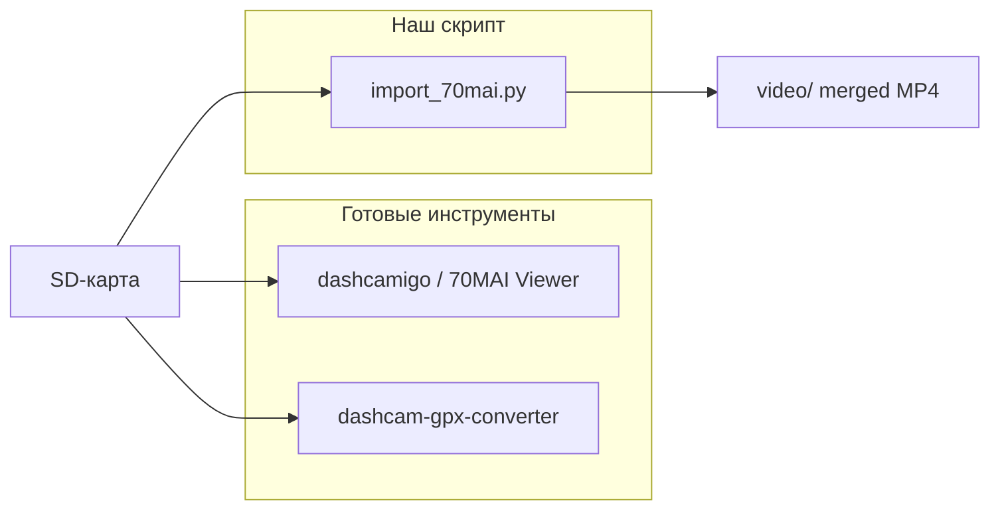
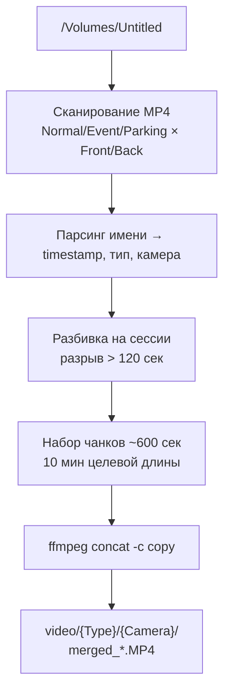

# Импорт и склейка видео с флеш-карты 70mai

## Контекст

Проект [`70mai_project`](/Users/cuthbert/work_local/70mai_project) сейчас содержит только workspace-файл — кода нет. SD-карта смонтирована в [`/Volumes/Untitled`](/Volumes/Untitled).

**Структура записей на карте:**

| Каталог | Префикс | Front | Back | Размер (Front) |
|---------|---------|-------|------|----------------|
| `Normal/` | `NO` | 463 | 463 | ~117 GB |
| `Event/` | `EV` | 237 | 237 | ~31 GB |
| `Parking/` | `PA` | 253 | 253 | ~31 GB |

**Итого ~358 GB** (Front + Back). Формат: H.264 MP4, ~260 MB/мин (Normal), ~131 MB/клип (Event).

**Именование файлов:**
```
NO20260425-130119-040747F.MP4
│  │       │       │      └─ F=Front, B=Back
│  │       │       └─ sequence ID
│  │       └─ время HHMMSS
│  └─ дата YYYYMMDD
└─ тип: NO/EV/PA
```

Normal-клипы идут **каждые 60 секунд** подряд. Между сессиями записи — разрывы (камера выключена, ~10 разрывов >2 мин за 463 клипа).

Папки `.s_Front` — служебные копии (~15 MB), **игнорируем**.

**ffmpeg на системе не установлен** — потребуется `brew install ffmpeg`.

### Идентификация модели на карте (A810)

На карте **нет файла с версией прошивки** при обычной записи. Модель определяется косвенно:

| Источник | Значение | Что означает |
|----------|----------|--------------|
| [`.used.file.DR2810`](/Volumes/Untitled/.used.file.DR2810) | `041231` | **DR2810** — внутренний код модели **70mai Dash Cam 4K A810** (из официального мануала). Число `041231` — счётчик следующего клипа (последний NO-файл: `...-041230F.MP4`), **не версия прошивки** |
| Разрешение Front | **3840×2160** (4K) | Спецификация A810 |
| Разрешение Back | **1920×1080** | Dual-channel A810 (RC11/RC12) |
| GPS-формат | `$V02` в `GPSData*.txt` | Формат A810 / A500S / A800 |
| EXIF фото | `model=96580`, `software=Verx.xx` | Novatek-платформа, версия **не записывается** на карту |

**Версию прошивки** (например `1.7.102ww`) можно узнать только через приложение 70mai → Настройки устройства, или при ручном OTA-обновлении (файл `FW98529A.bin` на карте).

---

## Готовые решения (результаты исследования)

**Вывод: готового инструмента «скачать с SD-карты 70mai + склеить в 10-минутные ролики» не существует.** Официальный 70mai и сторонние viewer'ы решают просмотр и точечный экспорт; batch-merge под формат `NO/EV/PA*.MP4` с раздельными Front/Back — только через ffmpeg/скрипт.

### Официальные средства 70mai

| Инструмент | Что делает | Подходит для нашей задачи? |
|------------|-----------|---------------------------|
| Мобильное приложение 70mai | Скачивание по Wi-Fi в альбом телефона | Нет — медленно, без batch-merge |
| USB-кабель / card reader | Карта как диск, ручное копирование | Частично — только копирование, без склейки |

### Специализированные инструменты для 70mai

| Инструмент | Платформа | Назначение | Ограничения |
|------------|-----------|------------|-------------|
| [70MAI DashCam Viewer](https://github.com/jorgenvchristiansen/70MAI) | macOS 14+ | Просмотр Front+Back+карта для A500S, экспорт пар клипов | Нет batch-merge, ~1 звезда, WIP |
| [70MaiM300Toolbox](https://github.com/XuZhen86/70MaiM300Toolbox) | Python/Docker | Скачивание с M300 по Wi-Fi/API | Только M300 по сети, не SD-карта |
| [WinMP4Extract](http://amicus.ba/index.php/programi/397-winmp4extract-program) | Windows | Извлечение GPS из MP4 и `GPSData*.txt` → GPX/KML/SRT | Только GPS, не merge |
| [70maiGpxPy](https://github.com/imutec/70maiGpxPy) | Python | `GPSData000001.txt` → GPX | Только GPS |
| [dashcam-gpx-converter](https://github.com/max2697/dashcam-gpx-converter) | Python/pip | `GPSData*.txt` → GPX | Только GPS |

GPS на вашей карте лежит в `GPSData000002.txt` / `GPSData000003.txt` (формат `$V02`, привязка к имени MP4) — это **отдельные файлы**, не встроены в видео. Склейка ffmpeg их не теряет, но и не объединяет автоматически.

### Универсальные dashcam-инструменты с поддержкой 70mai

| Инструмент | Merge | GPS 70mai | Batch ~358 GB | Заметки |
|------------|-------|-----------|---------------|---------|
| [dashcamigo](https://dashcamigo.app/en/) (браузер) | Да, stitch + export | Читает `.txt` с карты | Плохо — браузер, ручной export | Лучший готовый viewer: склеивает поездки, карта, Front+Back sync |
| [Dashcam Viewer](https://dashcamviewer.com) (платный) | Да | Только старый «Dash Cam Pro» | Нет | A500/A800/A810 **не поддерживаются** |
| RegistratorViewer (legacy) | Да | Нет | Нет | Не работает с dual Front/Back 70mai |
| LosslessCut | Да | Теряет GPS/metadata | Нет | Не подходит для dashcam |

### Инструменты склейки MP4 (не 70mai-specific)

| Инструмент | Суть | Применимость |
|------------|------|--------------|
| **ffmpeg concat** | `-f concat -c copy` | Основной метод — быстро, без перекодирования |
| [gyroflow/mp4-merge](https://github.com/gyroflow/mp4-merge) | Lossless merge с сохранением embedded metadata | Альтернатива ffmpeg; для 70mai GPS всё равно в `.txt` |
| [xiaomi-camera-merge-tool](https://github.com/Mrhs121/xiaomi-camera-merge-tool) | Python, merge по дням, incremental | Другой формат имён, нужна адаптация |
| [ffmpeg_concat](https://github.com/paizhangliu/ffmpeg_concat) | Bash, concat всех mp4 в папке | Без gap-detection и 10-min chunks |
| [Gist merge_fitcamx_ts.sh](https://gist.github.com/jonez1/acc90a90681b87b0f91afffaee876a36) | Bash, группировка по gap ≤3 мин | Близко к нашей логике, но под другой формат |

### Рекомендация



- **Просмотр и разовый экспорт** — [dashcamigo](https://dashcamigo.app/en/) (бесплатно, в браузере, понимает 70mai + GPS txt)
- **GPS → GPX** — [dashcam-gpx-converter](https://github.com/max2697/dashcam-gpx-converter) (`pip install dashcam-gpx-converter`)
- **Batch merge 358 GB → проект** — **свой скрипт** (план ниже); готового аналога под `NO/EV/PA` + Front/Back + 10 min chunks нет

Опционально: вместо ffmpeg concat можно использовать `mp4-merge` — сохраняет embedded tracks лучше, но для вашей камеры GPS внешний.

---

## Архитектура решения



---

## Алгоритм склейки

### 1. Сканирование
- Источник: `/Volumes/Untitled/{Normal,Event,Parking}/{Front,Back}/`
- Фильтр: `*.MP4`, без скрытых папок `.s_*`
- Сортировка по timestamp из имени файла

### 2. Разбивка на сессии
Consecutive clips группируются в одну «сессию записи». Новая сессия начинается, если разрыв между timestamp соседних файлов **> 120 секунд** (камера была выключена).

Пример Normal:
```
NO...130119...  ─┐
NO...130219...   │ сессия 1 (непрерывная запись)
NO...131519...  ─┘
  [разрыв 6 мин]
NO...132119...  ─┐ сессия 2
...
```

### 3. Нарезка на чанки ~10 минут
Внутри каждой сессии файлы накапливаются, пока суммарная длительность **не достигнет 600 сек** (или не закончатся файлы сессии).

- Для Normal: длительность берём из **ffprobe** (точнее, чем предполагать 60 сек — есть укороченные клипы вроде `NO...132119` ~14 MB)
- Для Event/Parking: только ffprobe (нерегулярные интервалы, median gap 16–194 мин)

### 4. Склейка через ffmpeg (без перекодирования)
```bash
ffmpeg -f concat -safe 0 -i filelist.txt -c copy output.mp4
```

`filelist.txt`:
```
file '/Volumes/Untitled/Normal/Front/NO20260425-130119-040747F.MP4'
file '/Volumes/Untitled/Normal/Front/NO20260425-130219-040748F.MP4'
...
```

`-c copy` — быстро, без потери качества. Все клипы одной камеры/режима имеют одинаковый кодек.

### 5. Именование выходных файлов
```
video/Normal/Front/NO_20260425-130119_131019_F.mp4
                 │   │ start      │ end (~10 min later)
                 │   └─ тип + дата-время начала
                 └─ каталог по типу и камере
```

---

## Структура каталогов проекта

```
70mai_project/
├── import_70mai.py          # основной скрипт
├── README.md                # инструкция по запуску
└── video/
    ├── Normal/
    │   ├── Front/           # ~47 файлов по ~2.6 GB (463 клипа / 10)
    │   └── Back/
    ├── Event/
    │   ├── Front/           # сессии событий, склеенные до 10 мин
    │   └── Back/
    └── Parking/
        ├── Front/           # редкие записи, часто 1 клип = 1 сессия
        └── Back/
```

---

## Реализация: [`import_70mai.py`](/Users/cuthbert/work_local/70mai_project/import_70mai.py)

Один Python-скрипт (stdlib + subprocess, без pip-зависимостей):

| Функция | Назначение |
|---------|------------|
| `parse_filename()` | Regex-парсинг `NO/EV/PA` + дата + камера |
| `scan_clips()` | Обход SD-карты, возврат отсортированного списка |
| `split_sessions()` | Разбивка по gap > 120 сек |
| `split_chunks()` | Нарезка сессий на блоки ~600 сек (ffprobe) |
| `merge_clips()` | ffmpeg concat, прогресс в stdout |
| `main()` | CLI с аргументами |

**CLI-параметры:**
```bash
python3 import_70mai.py \
  --source /Volumes/Untitled \
  --output ./video \
  --chunk-minutes 10 \
  --gap-seconds 120 \
  --types Normal,Event,Parking \
  --dry-run          # показать план без склейки
```

**Защита от повторного запуска:** если выходной файл уже существует — пропуск (resume).

**Dry-run режим:** вывести таблицу «N клипов → M выходных файлов» без копирования — полезно проверить план до ~358 GB обработки.

---

## Ожидаемый результат

| Тип | Front клипов | ~выходных файлов (10 мин) |
|-----|-------------|---------------------------|
| Normal | 463 | ~47 |
| Event | 237 | ~40–80 (зависит от длительности клипов) |
| Parking | 253 | ~50–100 (разрозненные сессии) |

**Время выполнения:** concat без перекодирования — ~минуты на файл (I/O bound). Полный прогон: несколько часов из-за объёма ~358 GB.

**Место на диске:** нужно **~360 GB свободного места** в каталоге проекта (merged_only — сырые клипы не копируются, но склеенные файлы ≈ тот же объём).

---

## Шаги выполнения

1. **Установить ffmpeg:** `brew install ffmpeg`
2. **Создать `import_70mai.py`** с логикой выше
3. **Запустить dry-run** — проверить план склейки
4. **Запустить импорт** — полная обработка всех 6 каталогов (3 типа × 2 камеры)
5. **Создать README** с примерами команд и описанием структуры

---

## Ограничения и примечания

- **GPS-файлы** (`GPSData000002.txt`, `GPSData000003.txt`) — не импортируем в этой итерации; при необходимости можно добавить позже
- **Screen recording** в `video/` — не трогаем
- Event/Parking клипы часто **короче 10 мин и разрознены** — склейка объединит только клипы внутри одной сессии (gap < 120 сек); одиночные клипы останутся отдельным файлом
- Если ffmpeg concat упадёт на конкретном файле (битый клип) — скрипт залогирует ошибку и продолжит со следующим чанком
