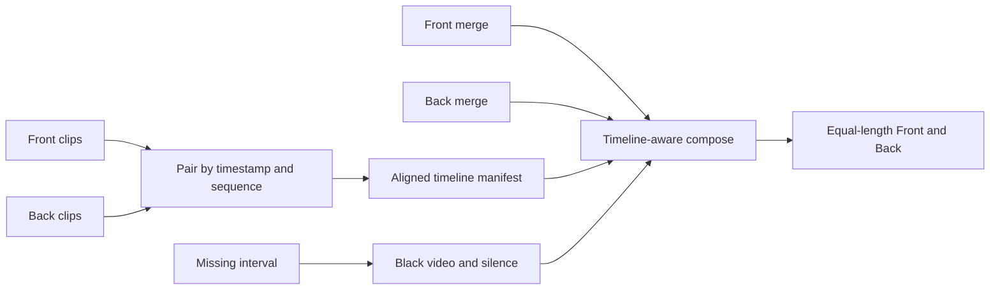

# Синхронизация Front/Back без накопления drift

## Подтверждённая причина

- В опубликованном Parking на кадре Front показывает `20:31:15`, Back — `20:29:03`: drift уже **2:12**, к концу доходит до 5–6 минут.
- Сейчас [`lib/import_70mai.py`](lib/import_70mai.py) независимо concatenates Front и Back, а [`lib/compose_2cam_70mai.py`](lib/compose_2cam_70mai.py) просто ставит два получившихся потока друг над другом. Любой пропавший/укороченный клип сдвигает соответствующую камеру до конца ролика.
- История сборки подтверждает два источника потерь: старый Front merge был короче плана на **420 с** (`6889.6` против `7309.6`), а затем отдельно найден quarantined `PA20250903-095947-043342F.MP4`, дающий ещё один 30-секундный разрыв. Поэтому сравнения общих длительностей и fallback `min(front, back)` недостаточно.

## Общая временная шкала

- Добавить модуль [`lib/clip_timeline.py`](lib/clip_timeline.py) с двумя режимами:
  - **Parking/Event:** compressed timeline из union слотов `(timestamp, sequence)`. Реальные многомесячные интервалы между parking events не вставляются; внутри каждого слота Front и Back выравниваются, отсутствующая камера получает black/silence, длительность слота равна большей доступной длительности пары.
  - **Normal:** wall-clock timeline поездки; начальные, внутренние и конечные пробелы одной камеры заполняются black/silence без сжатия времени.
- Во время import сохранять рядом с merge атомарный versioned manifest: исходный clip key, wall time, duration, merged offset и наличие каждой камеры. Manifest строить после завершения обеих камер и исключать `.bad`/quarantined клипы.

## Compose и проверки

- В [`lib/compose_2cam_70mai.py`](lib/compose_2cam_70mai.py) строить filter graph из real/black сегментов для каждой камеры; real сегмент брать по сохранённому merged offset, короткий хвост дополнять black, аудио выбранной камеры дополнять silence.
- Перед `vstack` гарантировать одинаковую длительность обеих дорожек и целевого timeline с допуском не больше одного кадра.
- В [`lib/compose_70mai.py`](lib/compose_70mai.py) заменить пропуск gaps в `plan_segments` на явное представление gaps для Normal; существующее поведение без manifest оставить только для совместимости старых Normal merges.
- В [`lib/plan_estimate.py`](lib/plan_estimate.py) считать Parking/Event duration как сумму union-слотов `max(front_slot, back_slot)`, а не `min(sum(front), sum(back))`.
- В [`lib/pipeline_repair.py`](lib/pipeline_repair.py) проверять manifest, монотонность offsets, соответствие merge duration реальному покрытию и итоговый drift. Известный отсутствующий слот становится предупреждением/black fill; stale manifest или необъяснимое расхождение остаётся blocker. Убрать опасный cap по меньшей камере для timeline-aware Parking/Event.
- После compose ffprobe-проверкой подтверждать целевую длительность; логировать число missing slots, black seconds по каждой камере и максимальный непрерывный gap.

## Тесты и документация

- Добавить [`tests/test_clip_timeline.py`](tests/test_clip_timeline.py): missing Front в начале/середине/конце, несколько пропусков, разные длительности пары, большие календарные gaps Parking без многомесячного black, wall-clock gaps Normal.
- Расширить тесты compose/filter graph и [`tests/test_pipeline_repair.py`](tests/test_pipeline_repair.py): итоговые дорожки равны, drift не накапливается, stale/missing manifest блокирует compose.
- Один раз в конце обновить [`README.md`](README.md) и [`GOALS.md`](GOALS.md): правила slot/wall-clock alignment, black/silence fallback, диагностика sync.

## Локальная пересборка Parking

- Перед пересборкой остановить watchdog/autopilot, чтобы процессы не меняли `.merge_stage` одновременно.
- После подключения `/Volumes/Untitled` повторно импортировать Parking, чтобы получить свежие Front/Back merges и timeline manifest; сохранить/reuse валидные stage parts, где возможно.
- Исправить `--compose-only`: если chunk уже uploaded, локальная пересборка не должна сбрасывать `uploaded=true` и терять ссылку на `8NBtxYkTCEM`.
- Собрать новый Parking MP4 в отдельном temp-каталоге с `--compose-only --no-state-on-sd --prune-merged off`, не загружать его и не удалять merges. Проверить ffprobe duration и выборочные кадры в начале, около известного bad clip и в конце; timestamps Front/Back должны соответствовать одному slot с допустимой разницей внутри исходной пары.
- Старый YouTube-ролик оставить без изменений до отдельного подтверждения пользователя.