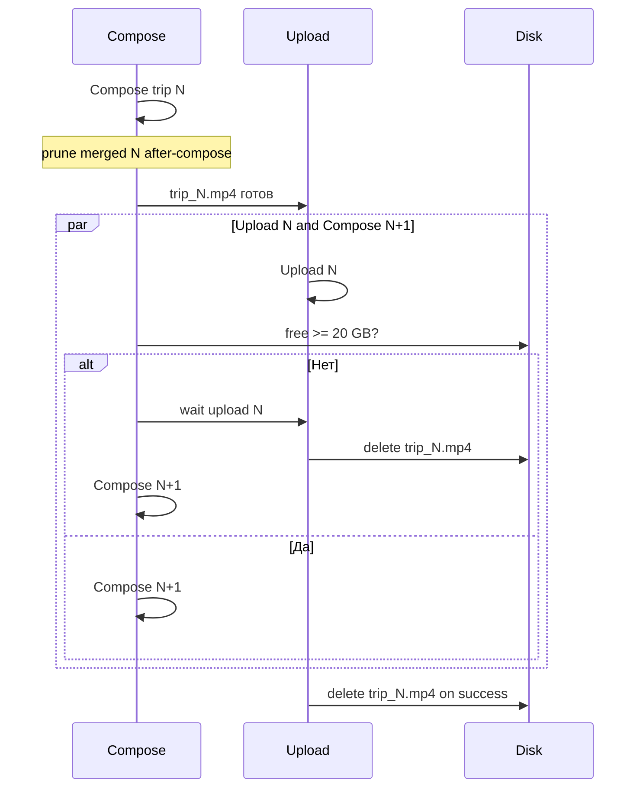

# Конвейер + диск 20 ГБ + YouTube-разрешение + живой прогресс

## Диагноз (кратко)

Trip 8 (2h 51m) не доезжает до YouTube: диск забит, soft disk-guard, watchdog убивает долгий/зависший encode. Uploads 1–7 уже OK; `Upload failed: 0`.

## Анализ логов — слабые места

| # | Слабое место | Доказательство | Эффект |
|---|--------------|----------------|--------|
| 1 | **Disk guard только warning** | 16× `Warning: 0.1–4.9 GB free`, compose всё равно стартует | 0-byte `trip_01.mp4`, ffmpeg hang/fail |
| 2 | **Merged uploaded trips не чистятся** | ~42 ГБ Normal до trip 8; prune не сработал на старых upload | Диск 95%, нет места под ~7 ГБ output |
| 3 | **Watchdog stall 1800s vs длинный encode** | 24 stall-kill; trip 8 нужен ~2–10 ч при 0.3–1.7× | Encode обрывается SIGTERM (-15) / SIGKILL (-9), прогресс теряется |
| 4 | **Нет heartbeat encode в лог** | После `Encode: … 0%` часами тишина при hang → stall detector | Ложные «stall» и реальные hang неразличимы без heartbeat |
| 5 | **Ложный 100% encode при ошибке** | `0% → 100% за 1m48s` затем `failed (exit 228)` | Падение VT-пайплайна на полном диске |
| 6 | **Watchdog без `--skip-import`** | Каждый restart: полный import (107 skip) + re-probe | Лишние минуты; шум в логе; дольше до compose |
| 7 | **Orphan composed MP4** | `chunk_01/trip_01.mp4` 1.5 ГБ после upload trip | Зря занимает место |
| 8 | **Stale upload session** | `trip_03.upload.json` от 8 Jul | Путаница при resume |
| 9 | **Event убит mid-compose** | `Publish [Event] exit -9` | Event так и не загружен |
| 10 | **Encode замедляется при давлении диска** | Было 1.69× → потом 0.25–0.33× на тех же сегментах | ETA раздувается, выше шанс stall-kill |

**Что работает хорошо:** import skip/resume; YouTube upload (0 fail в логе); resume уже загруженных trips; merge heartbeat; probe cache.

## Почему не удалились файлы уже загруженных поездок

Trips 1–7 в state: `uploaded=True` (`updated_at` 2026-07-08T13:52:15Z). Их merged Normal (~42 ГБ) всё ещё на диске.

Причины:

1. **`prune_merged` вызывается только в момент успешного upload/compose текущего trip.** Путь `Trip N: skip (already uploaded)` **не вызывает** `prune_merged_for_trip`.
2. Загрузки 1–7 прошли **до** появления prune (или без него); повторные запуски только скипают эти trips — prune для них никогда не отрабатывает.
3. В логах Jul 10 уже есть `--prune-merged after-upload`, но для skip это no-op. Soft disk-guard лишь пишет «consider after-compose» и **сам не чистит**.
4. Нет startup-sweep: «пройти state, для всех uploaded удалить merged, если ещё на диске».

**Фикс:** при старте publish + в `guard_free_disk` — `prune_all_uploaded_merged(state, trips, video_dir)`. На skip uploaded — тоже prune, если файлы остались. Лог: `Pruned uploaded trip N: freed X GB`.

**В dashboard / статусе** для каждой строки (включая done):

| Col | Пример |
|-----|--------|
| Status | `done` / `compose` / `upload` / `pending` / `fail` |
| YouTube | `youtu.be/EwC7pnDcLO0` или `—` |
| Disk | `merged 4.2G` / `pruned` / `compose 1.5G` / `clean` |

Шапка: `free 54 GB | merged on disk 107G | pruned this run 42G`.

## Оптимальное разрешение для YouTube (анализ)

Источник: [YouTube recommended upload encoding](https://support.google.com/youtube/answer/1722171). Наш формат — **вертикальный 2-cam stack** (Front↑ Back↓), не классический 16:9.

| Профиль / геометрия | Пиксели | Битрейт | Trip 8 (~172 мин) | Зачем |
|---------------------|---------|---------|-------------------|-------|
| Сейчас `balanced` 1206×1356 | 1.64 MPx | 6.5 Mbps | **~8.4 ГБ** | Чуть выше 720p-лестницы, битрейт ближе к 1080p |
| **Оптимум: 1080×1215 @ 5 Mbps** | 1.31 MPx | 5 Mbps | **~6.4 ГБ (−24%)** | Высота ≈1080p-лестница YouTube; битрейт = рекомендация для 720p / низ 1080p — достаточно для dashcam |
| `draft` 960×1080 @ 5 Mbps / 20 fps | 1.04 MPx | 5 Mbps | ~6.4 ГБ | Ещё легче, но 20 fps хуже для движения |
| 1440w stack / «4K» | 2.3–4+ MPx | 16–35 Mbps | 20–45 ГБ | Избыточно: YouTube всё равно пережмёт; диск/upload страдают |
| `hevc` 1206 @ 3.5 Mbps | 1.64 MPx | 3.5 Mbps | ~4.5 ГБ | Лучший размер, но на этом Mac HEVC HW недоступен → фолбэк на h264 |

**Вывод:** 4K/1440 для 2-cam не нужны — Front уже даунскейлится с 3840. Для архива на YouTube оптимально **ширина 1080, 25 fps, H.264 ~5 Mbps** (YouTube SDR: 720p→5 Mbps, 1080p→8 Mbps; наш кадр ~1.3 MPx → 5 Mbps достаточно, без «пустого» битрейта).

**В коде сейчас:** изменить профиль `balanced` → `width: 1080`, `hw_quality: 50` (5.0 Mbps). `quality` оставить 1206@7.5 для желающих. Автопилот по умолчанию `--profile balanced`. Обновить оценку MB/min в `plan_estimate` (~37.5 MB/min вместо ~45).

### В этом плане (сделать сейчас)

1. Жёсткий `--min-free-gb 20`: не стартовать compose, если места мало; ждать upload / **auto-prune всех uploaded** merged.
2. Дефолт `--prune-merged after-compose`.
3. **Startup + skip sweep:** prune merged для всех `uploaded=True` в state (ретроактивно чистит trips 1–7).
4. Конвейер: compose N → upload N в фоне → compose N+1 если free≥20; после upload удалить MP4.
5. **YouTube-профиль:** `balanced` = 1080w @ 5 Mbps @ 25 fps.
6. **Encode heartbeat** каждые 30 с в лог.
7. Watchdog: stall только если нет heartbeat **и** нет роста output; `WATCH_STALL_SEC` 7200.
8. Очистка orphan MP4 + stale `.upload.json` (merged 1–7 — кодом sweep или вручную в cleanup).
9. Живая TTY-таблица: Status + YouTube URL + Disk (merged/pruned/compose).
10. Запуск с `--skip-import` пока merged trip 8+ на месте.

### Следующие итерации (не блокируют сейчас)

- **Compose resume / chunked encode** для trip >2 ч — не терять 50% encode при kill.
- **Не перезапускать Event**, пока Normal pending (приоритет очереди).
- Запрос **YouTube quota increase** до больших пачек (>6/день).
- HEVC-профиль, когда HW появится — ещё −40% к размеру.

## Целевой конвейер



## Очистка сейчас (~44 ГБ)

1. Stop watchdog / publish_all / publish_70mai / ffmpeg.
2. Удалить `chunk_01/trip_01.mp4`, `chunk_03/trip_01.mp4`, stale `trip_03.upload.json`.
3. Удалить merged Normal для trips 1–7 (до `2026-04-26 15:33:56`).
4. Не трогать Event и Normal trip 8+.

## Код

- [`compose_70mai.py`](compose_70mai.py) — `balanced`: width 1080, hw_quality 50; encode heartbeat.
- [`plan_estimate.py`](plan_estimate.py) — MB/min под новый битрейт.
- [`publish_70mai.py`](publish_70mai.py) — guard, prune defaults, status JSON.
- [`publish_all_70mai.py`](publish_all_70mai.py) — defaults 20 / after-compose, dashboard.
- [`scripts/watch_publish_all_70mai.sh`](scripts/watch_publish_all_70mai.sh) — stall по росту файла / 7200s.
- Новый [`autopilot_dashboard.py`](autopilot_dashboard.py).
- [`README.md`](README.md).

## Запуск

```bash
./scripts/watch_publish_all_70mai.sh --skip-import --force-restart
```

Дефолты: `--min-free-gb 20`, `--prune-merged after-compose`, `balanced` 1080@5Mbps, overlap on, dashboard on.

Commit + push автоматически.
