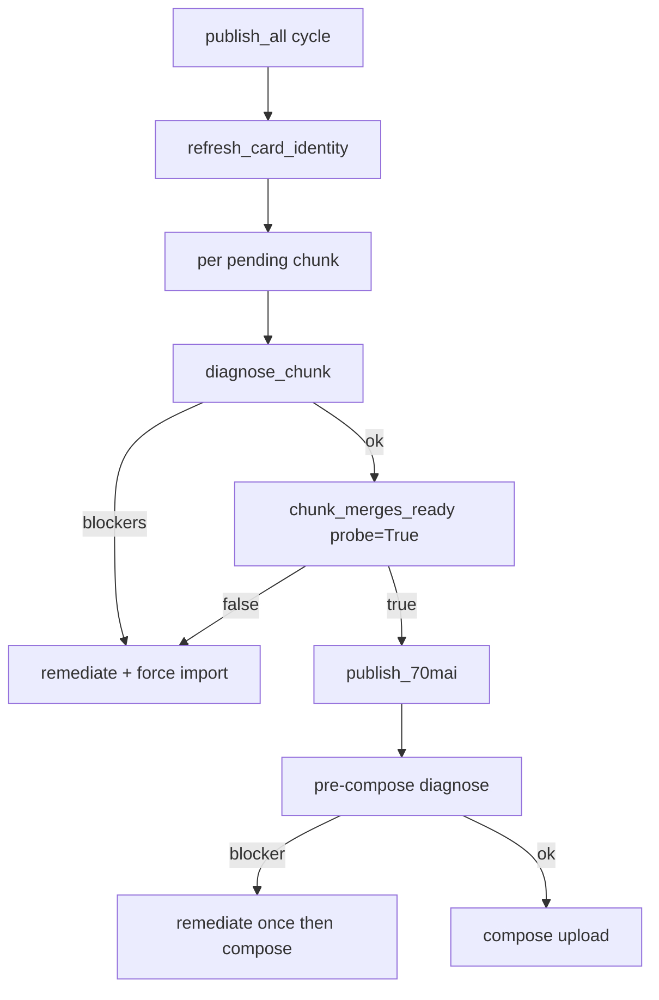

# Pipeline auto-repair (Parking/Event)

## Context

Autopilot fails on Parking compose: Front merge ~6889s vs trip ~7309s; import skips existing file (`MERGE_DURATION_TOLERANCE=0.85`); `chunk_merges_ready` uses `probe=False` and falsely skips import. Fix: **Detect → Remediate → Retry once**.

## Chosen defaults

- `--repair auto` by default (diagnose + fix); also `diagnose` / `off`
- Event/Parking merge tolerance **0.98**; Normal stays **0.85**
- Max **2** remediations + **2** import retries per chunk per session
- Cap compose duration only as last fallback after rebuild fails
- Wire existing unused [`card_identity.py`](card_identity.py) into autopilot startup

## Architecture

## Implementation

### 1. New module [`pipeline_repair.py`](pipeline_repair.py)

- `HealthIssue(code, record_type, camera, severity, message, remediation)`
- Codes: `merge_short`, `merge_stale`, `merge_fb_mismatch`, `compose_gap`, `compose_part_stale`, `state_drift`
- `diagnose_chunk(source, video_dir, chunk, import_store=None) -> list[HealthIssue]`
  - Probe Front/Back merges vs `trip.duration_sec` (threshold 0.98)
  - Dry-run `plan_segments(..., probe=True)`; catch coverage gaps
  - F/B duration mismatch >2%
- `remediate(issues, video_dir, import_store, dry_run=False) -> list[str]`
  - `rebuild_merge`: unlink short/stale `PA_`/`EV_` files; `invalidate_merge` in store
  - Never touch uploaded chunks
- Append actions to `video/Output/.publish_tmp/repair_log.jsonl`
- `diagnose_and_repair(...) -> bool` (True = safe to publish)

### 2. Stricter import + fingerprint — [`import_70mai.py`](import_70mai.py), [`import_state.py`](import_state.py)

- `MERGE_DURATION_TOLERANCE_EVENT = 0.98` for Event/Parking in `is_valid_merge_output` / `merge_clips`
- Before skip: compare `clip_count` (+ last clip name if available) to stored merge record; mismatch → rebuild
- `process_event_group`: log warn if Front/Back clip counts differ
- `ImportStateStore.invalidate_merge(filename)` and store `clip_count`, `expected_duration_sec` on skip/merge
- `compact_event_state()` for Event/Parking: drop noisy single-clip `pending` when mega-merge exists

### 3. Autopilot gate — [`publish_all_70mai.py`](publish_all_70mai.py)

- Call `refresh_card_identity` at cycle start
- Replace skip-import path (~line 887):
  - `diagnose_chunk` → if issues: remediate, force import (do not skip)
  - else `chunk_merges_ready(..., probe=True, min_coverage=0.98)`
- Fix [`chunk_merges_ready`](publish_all_70mai.py): `probe=True`; require summed segment duration ≥ 98% of trip
- CLI: `--repair {auto,diagnose,off}` (default `auto`)
- Import retry loop: on repair codes, delete + reimport up to 2 times

### 4. Publish last line — [`publish_70mai.py`](publish_70mai.py), [`compose_2cam_70mai.py`](compose_2cam_70mai.py)

- Before `run_compose_2cam` in `publish_chunk`: diagnose; if blocker and repair=auto → remediate + one import subprocess, then retry compose once
- Fallback: `duration = min(trip.duration_sec, front_dur, back_dur)` with `[repair] capped...` log
- Tighten `trip_part_complete` for Event/Parking: require segment coverage via `plan_segments`, not only 90% duration

### 5. Observability — [`autopilot_dashboard.py`](autopilot_dashboard.py)

- Show last repair actions / health from `repair_log.jsonl`
- Log lines: `[repair] diagnosing...`, `[repair] rebuilt PA_...`, `[repair] retry import (1/2)`

### 6. Tests — [`test_pipeline_repair.py`](test_pipeline_repair.py)

- `merge_short` detected (6889 vs 7309)
- Remediatе deletes file + resets state
- `chunk_merges_ready` with probe catches gap
- Compose duration cap fallback
- No repair when chunk already uploaded
- Stricter Event/Parking tolerance rejects 94% file

### 7. Docs (one batch at end)

- [`README.md`](README.md): Auto-repair + `--repair`
- [`GOALS.md`](GOALS.md): self-healing note under Parking
- Brief codes table in [`детальное_описание.md`](детальное_описание.md)

## Out of scope

- Manual rebuild of current broken Front file (autopilot will do it on next run with `--repair auto`)
- Changing Normal merge tolerance or trip packing
