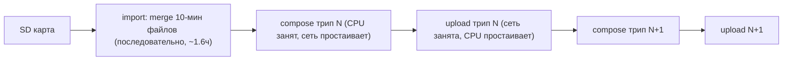
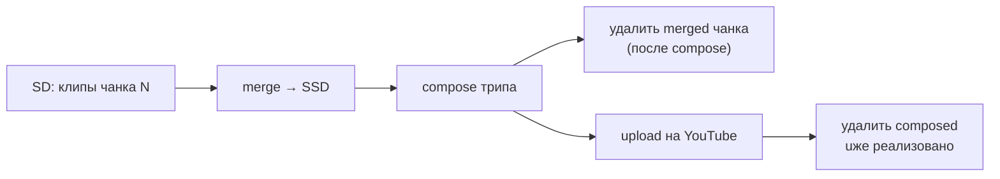

# Аудит производительности и план экстремального ускорения

## Результаты аудита

### Оборудование и среда
- **CPU**: Intel i5-8210Y, 2 ядра / 4 потока, 1.6 ГГц, 7W, пассивное охлаждение (троттлинг под нагрузкой). Есть QuickSync: H.264 **и HEVC** аппаратный энкод/декод
- **RAM** 8 GB, macOS 14.8.7
- **Диск хоста**: 13 GB свободно (95% занято) — критично
- **SD-карта**: USB, чтение медленное (двойные ffprobe-проходы дорогие)
- **Сеть**: 39.7 Mbps uplink, но реальный upload ~0.9 MB/s (~7 Mbps) — одиночный TCP-поток при латентности 334 мс и bufferbloat

### Текущий пайплайн (всё последовательно)

### Узкие места (по влиянию)
1. **Квота YouTube API**: ~6 видео/сутки. Per-trip режим = 12 загрузок на карту = 2 суток независимо от скорости
2. **Нет перекрытия compose и upload** — суммарное время вместо max(encode, upload)
3. **Upload 0.9 MB/s при канале 5 MB/s** — один TCP-поток + высокая латентность
4. **CPU-декод при compose** — `hw_decode=False` по умолчанию ([compose_70mai.py](compose_70mai.py) PROFILES), декод 2×1080p софтом на 2 ядрах
5. **Тройной ffprobe SD-клипов** — plan в `publish_all`, затем import, затем publish (по ~700 клипов через USB каждый раз)
6. **Битрейт 6.5 Mbps H.264** — 2.9 GB/час на upload при канале ~0.9 MB/s
7. **13 GB диска**: merged-файлы копятся навсегда в `video/Output/`

## План оптимизаций

### Фаза 1 — быстрые победы (код, без смены архитектуры)

- **HEVC-профиль** `hevc` в [compose_70mai.py](compose_70mai.py): `hevc_videotoolbox` ~3.5 Mbps (визуально = H.264 6.5 Mbps) → **upload в ~1.9 раза быстрее**. QuickSync Amber Lake поддерживает; YouTube принимает HEVC
- **Флаги энкодера**: `-prio_speed 1 -realtime 1` для videotoolbox (быстрее на слабом CPU)
- **hw_decode по умолчанию** в профилях (fallback-цепочка из 3 попыток уже реализована, строки 938–943) → декод на QuickSync, разгрузка CPU в 2–3 раза
- **Общий кэш ffprobe** `video/Output/.probe_cache.json` (ключ: путь+mtime+size): убирает 2 из 3 проходов по SD (~10–20 мин на запуск)
- **Убрать повторный ffprobe** при skip-проверке merge-выходов (кэшировать валидацию)

### Фаза 2 — конвейеризация (главный структурный выигрыш)

- **Compose N+1 параллельно с upload N** в [publish_70mai.py](publish_70mai.py) `publish_and_upload_trips`: фоновый upload-поток с очередью (глубина 1) + guard свободного диска (мин. 2×размер трипа). Итог: время = max(encode, upload) вместо суммы → **-35–45% wall time**
- **Параллельные merge при import** (2 воркера: Front и Back одновременно) в [import_70mai.py](import_70mai.py) — concat I/O-bound, USB выдержит 2 потока → import **~-30%**
- **Параллельный upload 2 видео** (опция): при латентной сети одиночный поток не утилизирует канал; 2 потока → суммарно ~1.6–1.8× быстрее. Реализация: upload Event параллельно с Normal

### Фаза 3 — квота и архитектура (максимальный эффект)

- **Режим чанков вместо per-trip для квоты**: 5 чанков + 1 Event = 6 загрузок = ровно дневная квота (vs 12 per-trip). Флаг выбора в autopilot + предупреждение о квоте в plan summary
- **Запросить увеличение квоты** YouTube API (форма Google, бесплатно) — документировать в README
- **Опция compose прямо с SD** (пропуск import merge для публикации): читаем 1-мин клипы напрямую, экономим полный цикл чтение→запись→чтение (~1.6 ч + 20 GB диска). Import остаётся как отдельный архивный шаг
- **Очистка merged после upload** (опция `--prune-merged`): удалять 10-мин файлы трипа после успешной загрузки на YouTube

### Детально: жизненный цикл промежуточных файлов на SSD (резерв места)

Что уже есть: composed-видео удаляется сразу после успешного upload (`upload_and_cleanup` в [publish_70mai.py](publish_70mai.py)); trip-части удаляются после конкатенации в трип. Что копится и не удаляется: **merged 10-мин файлы** в `video/Output/<карта>/` (~20 GB на карту — главный потребитель) и upload-сессии.

Схема «сделали → загрузили → удалили» на каждом шаге:

- **`--prune-merged` с двумя режимами**: `after-upload` (консервативно — merged живут до подтверждения YouTube, можно пересобрать compose) и `after-compose` (агрессивно — merged чанка удаляются сразу после того, как composed-файл трипа готов и провалидирован; пик занятости на диске = 1 чанк merged + 1 composed ≈ 3–4 GB вместо 20+). Клипы-исходники остаются на SD, значит merged всегда можно пересоздать — потери данных нет
- **Merge по требованию, а не всей карты**: сейчас import склеивает всю карту до начала publish. В конвейерном режиме merge только чанков текущего трипа перед его compose — на диске одновременно данные одного трипа, а не всей карты
- **Disk guard с резервом** `--min-free-gb` (по умолчанию ~5 GB): перед каждым merge/compose проверять свободное место; если ниже порога — сперва удалить merged уже загруженных трипов (по publish-state знаем, что uploaded=true), затем при необходимости ждать завершения текущего upload (он освободит composed). Autopilot никогда не упирается в полный диск
- **Чистка хвостов**: upload-сессии (`.upload_session_*.json`) уже чистятся; добавить удаление осиротевших chunk-директорий и невалидных merge-обрывков при старте

### Детально: работа с флеш-диском (буферизация)

Факты: USB-ридер даёт ~30 MB/s реальных; сотни файлов по ~60 MB; каждый open/close на FAT/exFAT добавляет накладные на метаданные; ридер может троттлить от нагрева.

- **Фоновый prefetch следующего чанка**: пока ffmpeg склеивает чанк N, отдельный поток читает файлы чанка N+1 в page cache macOS (простое последовательное чтение в `/dev/null`). Merge N+1 начинается уже «из памяти». RAM 8 GB достаточно для одного 10-мин чанка (~600 MB). Реализация в [import_70mai.py](import_70mai.py)
- **Не копировать карту на SSD целиком** — на хосте только 13 GB; выборочный prefetch в RAM-кэш даёт тот же эффект без записи на диск
- **RAM-диск не нужен**: page cache решает задачу автоматически, без ограничений на размер
- **Один физический проход по SD за запуск**: probe-кэш (выше) + merge = единственное полное чтение. Compose читает уже merged-файлы с внутреннего SSD, а не SD
- Чтение SD и запись на SSD хоста — разные шины, уже параллельны; 2 merge-воркера (Front+Back) удвоят утилизацию USB-очереди

### Детально: ускорение склейки файлов из кусков

Факты: concat `-c copy` — это I/O-bound копирование, не перекодирование; узкое место — последовательные спавны ffmpeg и чтение с USB по одному файлу.

- **Параллельные merge** (2 воркера) — главный выигрыш, см. Фазу 2
- **Крупнее import-чанки** (опция `--chunk-minutes 30..60` из autopilot): вместо ~100 файлов на карту — ~20; меньше спавнов ffmpeg, меньше ffprobe-валидаций выходов, меньше метаданных FAT. Для compose границы файлов не важны (режет по wall-clock). Ограничение: файл 60 мин ≈ 3.5 GB — учесть 13 GB диска в disk guard
- **Убрать лишний ffprobe выходов**: результат валидации писать в import-state (кэш «файл X проверен при mtime Y»), не пробить заново при каждом skip-проходе
- **ffmpeg-флаги чтения**: для concat-демьюксера добавить `-probesize 1M -analyzeduration 0` на вход (клипы одинаковые, глубокий анализ не нужен) — быстрее старт каждого merge
- Вариант «объединить всё одним ffmpeg-вызовом» отклонён: один сбой = потеря всего вывода, retry-гранулярность важнее

### Детально: ускорение загрузки на YouTube

Факты из документации Google: приём идёт через `upload.googleapis.com` — это уже **anycast-инфраструктура Google** (запрос попадает на ближайший edge автоматически). Отдельного «CDN для загрузки» у YouTube API нет; сторонние сервисы-посредники добавляют hop и не ускоряют. Параллельная загрузка чанков одного видео протоколом **не поддерживается** (в отличие от S3 multipart) — чанки строго последовательны.

Что реально ускоряет:
- **Большие чанки или whole-file**: Google рекомендует `chunksize=-1` (весь файл одним PUT) на стабильных соединениях — каждый чанк сейчас (64 MB) добавляет паузу RTT 334 мс + переустановку TCP-окна. Сделать 256 MB по умолчанию и `--upload-chunk-mb 0` = whole-file в [youtube_upload.py](youtube_upload.py). Resume при обрыве сохраняется (протокол докачивает с offset)
- **Параллелизм на уровне видео** — единственный легальный способ параллелизма: 2 одновременных upload (Normal-трип + Event, или 2 трипа) → при латентном канале суммарно ~1.6–1.8×. См. Фазу 2
- **Меньше байт = быстрее всего**: HEVC-профиль (Фаза 1) сокращает объём в ~1.9×; это эквивалент удвоения скорости сети
- **TCP-тюнинг macOS**: поднять `kern.ipc.maxsockbuf` и send-буфер (`net.inet.tcp.sendspace`) — при RTT 334 мс окно по умолчанию ограничивает single-stream throughput; документировать в README как опциональный шаг
- **Диагностика провайдера**: uplink 39.7 Mbps, а фактический upload 7 Mbps — проверить QoS/shaping у провайдера в часы дня; VPN через другой маршрут иногда обходит shaping (документировать как эксперимент, не как код)

### Рекомендации по среде (вне кода — в README)
- Подставка/охлаждение под MacBook (пассивный i5-8210Y троттлит на длинных encode)
- USB3-кардридер вместо текущего подключения
- Ethernet/другой роутер: bufferbloat (334 мс) режет upload в разы; включить SQM/QoS на роутере
- Освободить диск хоста (95% занято — деградация APFS и риск срыва compose)

## Ожидаемый эффект (карта 7.5 ч записи, 12 трипов)

| Конфигурация | Время до полной выгрузки |
|---|---|
| Сейчас | ~10–11 ч (2 суток из-за квоты) |
| Фаза 1 (HEVC + hw_decode + кэш) | ~6 ч |
| + Фаза 2 (конвейер + 2 upload-потока) | ~4 ч |
| + Фаза 3 (чанки в квоту, compose с SD) | **~2.5–3 ч, 1 сутки квоты** |

## Файлы к изменению
- [compose_70mai.py](compose_70mai.py) — профиль hevc, флаги prio_speed/realtime, hw_decode default
- [publish_70mai.py](publish_70mai.py) — фоновый upload-поток, disk guard, prune-merged
- [import_70mai.py](import_70mai.py) — параллельные merge, probe-кэш, prefetch следующего чанка, флаги -probesize/-analyzeduration
- [youtube_upload.py](youtube_upload.py) — чанк 256 MB / whole-file (`--upload-chunk-mb`)
- [publish_all_70mai.py](publish_all_70mai.py) — выбор chunk/per-trip, предупреждение о квоте, параллельный Event-upload
- [plan_estimate.py](plan_estimate.py) — probe-кэш, расчёт квоты в плане
- [README.md](README.md), [GOALS.md](GOALS.md) — новые флаги, рекомендации по среде