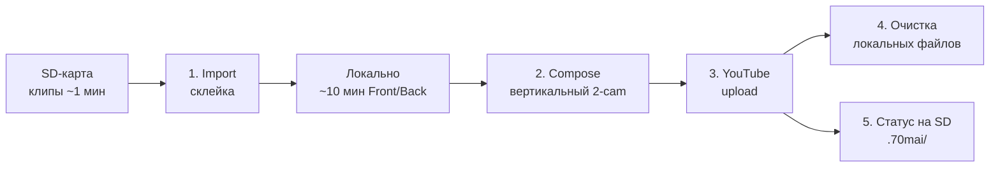

# 70mai — от флешки до YouTube

Проект берёт запись с регистратора **70mai**, склеивает ролики и заливает на YouTube.

Кратко для запуска. Флаги, OAuth, профили, тюнинг — в [детальное_описание.md](детальное_описание.md).

---

## Схема пайплайна



---

## Что происходит по шагам

### 1. Import — lossless concat

Короткие клипы (~1 мин) с SD (`Normal` / `Event` / `Parking`, Front и Back).

- **Normal** → сессии → чанки ~10 мин (`ffmpeg concat -c copy`).
- **Event / Parking** → все клипы камеры в **один** mega-файл.
- Prefetch в page-cache; склейка читает клипы с SD (как ночной прогон Parking ~04:00).

В логе: `ffmpeg concat -c copy …` / `merging …`.

### 2. Compose — вертикальное видео

Front сверху, Back снизу → один ролик на поездку/чанк (профиль по умолчанию `balanced`: 1080px / 5000k).

### 3. Upload — YouTube

Ролик уходит на канал (по умолчанию private).
### 4. Очистка Mac

После успешной загрузки (или после compose — см. `prune_merged`) временные склейки удаляются, чтобы освободить диск.

### 5. Статус на флешке

В `/.70mai/` на SD пишутся статусы, ссылки YouTube и краткий отчёт — можно продолжить на другом Mac.

---

## Как запустить

Нужны: Mac, Python 3.10+, ffmpeg, вставленная SD-карта 70mai.

```bash
scripts/setup-venv.sh          # первый раз
./scripts/publish_all_70mai.sh --wait
./scripts/watch_publish_all_70mai.sh --wait   # то же + авто-рестарт
```

Карта уже вставлена: те же команды без `--wait`.

Прогресс в другом окне:

```bash
./scripts/autopilot_dashboard.sh
```

Во время import дашборд показывает параллельно:
`► [copy] … N/M MB (%)` и `► [merge] … N/M MB (%)`, плюс блок **процессы**.

---

## Первый запуск YouTube

Положите OAuth-файл в `~/.config/70mai/youtube_credentials.json` и при первом upload войдите в браузере.  
Подробности: [детальное_описание.md](детальное_описание.md#youtube-oauth-one-time).

---

## Тюнинг

Compose-профиль и запас диска — флаги autopilot:

```bash
./scripts/publish_all_70mai.sh --profile balanced --min-free-gb 20
```

`70mai_runtime.json` сейчас не управляет import (возвращён алгоритм ~04:00: concat с SD + page-cache prefetch).

---

## Полезное

| Действие | Команда |
|----------|---------|
| Что на карте | `python3 import_70mai.py --scan` |
| Только план | `./scripts/publish_all_70mai.sh --dry-run` |
| Отметить залитое | `python3 publish_70mai.py --types Parking --mark-uploaded 1:1:VIDEO_ID --state-on-sd --resume` |
| Лог автопилота | `tail -f video/Output/.publish_tmp/publish_all.log` |
| Лог watchdog | `tail -f video/Output/.publish_tmp/publish_all_watchdog.log` |
| Отчёт по карте | `./scripts/generate_card_reports.sh` |

Цели: [GOALS.md](GOALS.md). Детали: [детальное_описание.md](детальное_описание.md).
