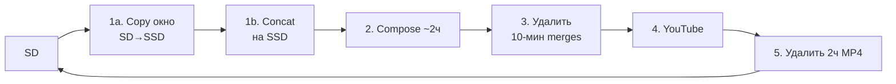

# 70mai — от флешки до YouTube

Проект берёт запись с регистратора **70mai**, склеивает ролики и заливает на YouTube.

Кратко для запуска. Флаги, OAuth, профили, тюнинг — в [детальное_описание.md](детальное_описание.md).

---

## Схема пайплайна



Один цикл = **один ролик** (~120 мин). С SD копируется только окно этого ролика; если склейки уже на SSD — copy/import skip.

---

## Что происходит по шагам

1. **Import (SD→SSD)** — `[copy]` клипы окна на SSD → `[merge]` concat локально. Уже есть `NO_`/`PA_` на SSD → skip.
2. **Compose** — Front↑ Back↓ → один ~2ч MP4 (`balanced`).
3. **Prune merges** — 10‑мин файлы на SSD удаляются сразу после compose.
4. **Upload** — YouTube; затем удаляется 2ч MP4.
5. Следующий chunk.

Статус/ссылки — в `/.70mai/` на SD.

---

## Как запустить

Нужны: Mac, Python 3.10+, ffmpeg, вставленная SD-карта 70mai.

```bash
scripts/setup-venv.sh          # первый раз
./scripts/publish_all_70mai.sh --wait
./scripts/watch_publish_all_70mai.sh --wait   # то же + авто-рестарт
```

Карта уже вставлена: те же команды без `--wait`.

Прогресс: `./scripts/autopilot_dashboard.sh` — показывает конвейер ролика:
`[copy] SD→SSD` → `[merge] 10-мин` → `[compose] Front↑+Back↓` → `[ролик] ~2ч YouTube`.

---
## Первый запуск YouTube

Положите OAuth-файл в `~/.config/70mai/youtube_credentials.json` и при первом upload войдите в браузере.  
Подробности: [детальное_описание.md](детальное_описание.md#youtube-oauth-one-time).

---

## Тюнинг

Compose-профиль и запас диска — флаги autopilot:

```bash
./scripts/publish_all_70mai.sh --profile balanced --min-free-gb 20 --chunk-minutes 120
```

Import staging: [`70mai_runtime.json`](70mai_runtime.json) — `stage_batch_clips`, `chunk_clips`, `prefetch_batches`.

`--prune-merged after-compose` (default) — 10‑мин склейки удаляются сразу после 2ч compose; 2ч MP4 — после YouTube.

### Auto-repair (Parking/Event)

По умолчанию `--repair auto`: перед import/compose проверяет, что SSD-merge покрывает план (≥98%). Короткий/устаревший `PA_`/`EV_` удаляется и пересобирается; если rebuild недоступен — compose берёт `min(trip, front, back)`.

```bash
./scripts/publish_all_70mai.sh --wait --repair auto       # default
./scripts/publish_all_70mai.sh --types Parking --repair diagnose
./scripts/publish_all_70mai.sh --repair off               # legacy skip
```

Лог фиксов: `video/Output/.publish_tmp/repair_log.jsonl`.

---

## Полезное

| Действие | Команда |
|----------|---------|
| Что на карте | `python3 import_70mai.py --scan` |
| Только план | `./scripts/publish_all_70mai.sh --dry-run` |
| Отметить залитое | `python3 publish_70mai.py --types Parking --mark-uploaded 1:1:VIDEO_ID --state-on-sd --resume` |
| Лог автопилота | `tail -f video/Output/.publish_tmp/publish_all.log` |
| Лог watchdog | `tail -f video/Output/.publish_tmp/publish_all_watchdog.log` |
| Лог auto-repair | `tail -f video/Output/.publish_tmp/repair_log.jsonl` |
| Отчёт по карте | `./scripts/generate_card_reports.sh` |

Цели: [GOALS.md](GOALS.md). Детали: [детальное_описание.md](детальное_описание.md).
