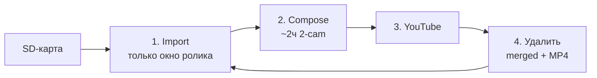

# 70mai — от флешки до YouTube

Проект берёт запись с регистратора **70mai**, склеивает ролики и заливает на YouTube.

Кратко для запуска. Флаги, OAuth, профили, тюнинг — в [детальное_описание.md](детальное_описание.md).

---

## Схема пайплайна



Один цикл = **один ролик** (~120 мин поездок, или весь Event/Parking). Всю карту сразу не импортируем.

Ручной `import_70mai.py --types Normal` без `--from`/`--to` **запрещён** (нужен `--full-card` только осознанно) — иначе снова забьёт диск, как 12.07.

---

## Что происходит по шагам

1. **Import** — concat только для окна текущего chunk (`--from`/`--to`). Event/Parking — все клипы типа → один mega-файл.
2. **Compose** — Front↑ Back↓, `balanced` (1080 / 5000k). Короткие поездки в chunk склеиваются в один MP4.
3. **Upload** — один ролик на YouTube (private).
4. **Prune** — удалить merged + composed (`--prune-merged after-upload` по умолчанию). Клипы на SD не трогаем.
5. Следующий pending chunk.

Статус/ссылки пишутся в `/.70mai/` на SD.

---

## Как запустить

Нужны: Mac, Python 3.10+, ffmpeg, вставленная SD-карта 70mai.

```bash
scripts/setup-venv.sh          # первый раз
./scripts/publish_all_70mai.sh --wait
./scripts/watch_publish_all_70mai.sh --wait   # то же + авто-рестарт
```

Карта уже вставлена: те же команды без `--wait`.

Прогресс: `./scripts/autopilot_dashboard.sh`

---
## Первый запуск YouTube

Положите OAuth-файл в `~/.config/70mai/youtube_credentials.json` и при первом upload войдите в браузере.  
Подробности: [детальное_описание.md](детальное_описание.md#youtube-oauth-one-time).

---

## Тюнинг

Compose-профиль и запас диска — флаги autopilot:

```bash
./scripts/publish_all_70mai.sh --profile balanced --min-free-gb 20 --chunk-minutes 120
```

`--prune-merged after-upload` (default) — исходные merged удаляются после успешной заливки ролика.

---

## Полезное

| Действие | Команда |
|----------|---------|
| Что на карте | `python3 import_70mai.py --scan` |
| Только план | `./scripts/publish_all_70mai.sh --dry-run` |
| Отметить залитое | `python3 publish_70mai.py --types Parking --mark-uploaded 1:1:VIDEO_ID --state-on-sd --resume` |
| Лог автопилота | `tail -f video/Output/.publish_tmp/publish_all.log` |
| Лог watchdog | `tail -f video/Output/.publish_tmp/publish_all_watchdog.log` |
| Отчёт по карте | `./scripts/generate_card_reports.sh` |

Цели: [GOALS.md](GOALS.md). Детали: [детальное_описание.md](детальное_описание.md).
