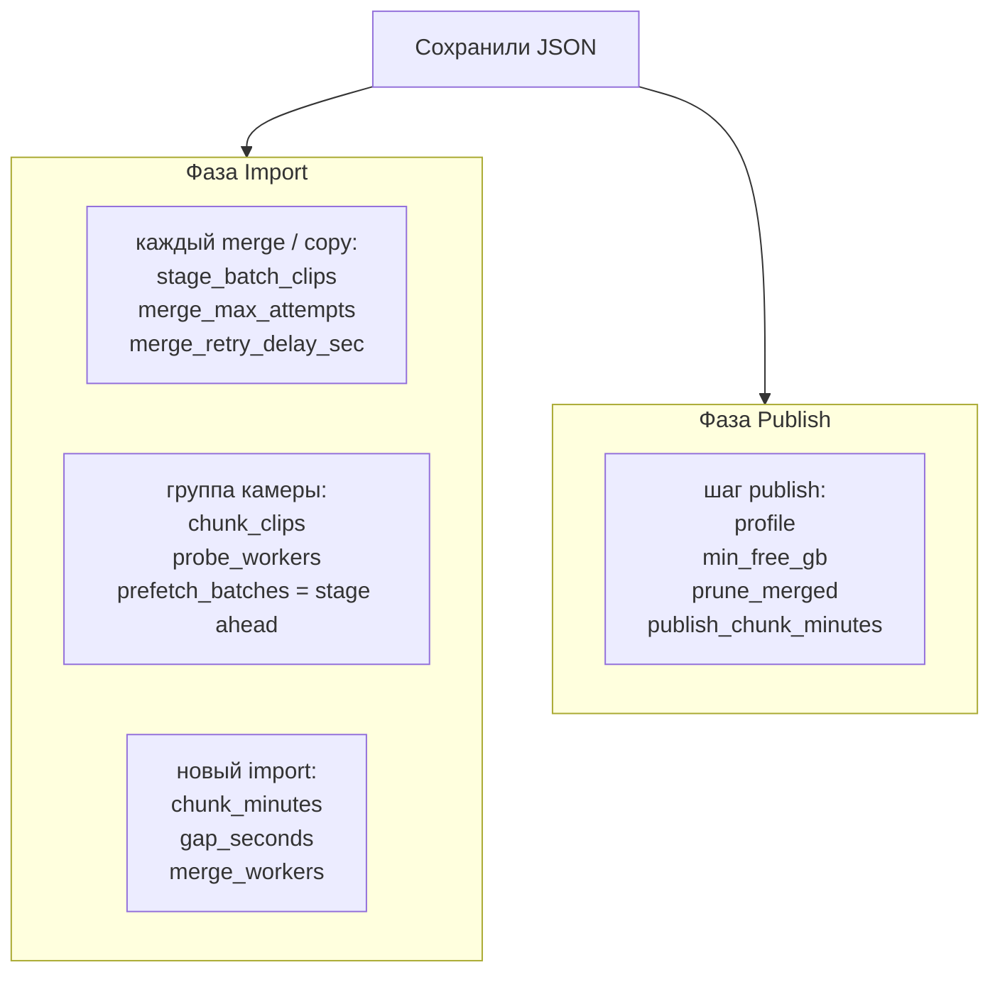
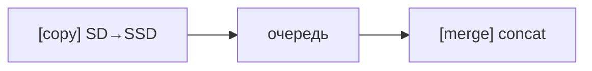

# Детальное описание (служебный документ)

Технические детали пайплайна 70mai: флаги CLI, OAuth, профили encode, layout SD, отладка.
Для повседневной работы см. короткий [README.md](README.md).

---

# 70mai Video Import

Import and merge 70mai A810 SD card clips into ~10 minute videos.

## Requirements

- Python **3.10+** (recommended: **3.12** via Homebrew — system `/usr/bin/python3` 3.9 uses LibreSSL and triggers Google API warnings)
- ffmpeg (`brew install ffmpeg`)

### Python setup

First time only (or after dependency changes):

```bash
scripts/setup-venv.sh
```

All CLI scripts **auto-use `.venv`** — run via `./run publish_70mai.py …` (modules live in `lib/`); if `.venv` is missing, it is created on first run.

Alternative launcher:

```bash
./run publish_70mai.py --source /Volumes/Untitled --estimate-only
```

## Quick start on a new Mac

```bash
brew install python@3.12 ffmpeg
git clone https://github.com/cuthbertnogood/70mai-project.git
cd 70mai-project
scripts/setup-venv.sh
./run import_70mai.py --scan --source /Volumes/Untitled
```

**Not in git** (copy separately or recreate on the new host):

| Item | Purpose |
|------|---------|
| SD card with 70mai clips | source media |
| `~/.config/70mai/youtube_credentials.json` | YouTube OAuth client (one-time) |
| `~/.config/70mai/youtube_token.json` | refresh token after browser login |
| `/.70mai/auth/` on SD | portable OAuth — autopilot picks it up with `--auth-on-sd` (default) |

`video/` and all `.mp4` files stay local — import/compose recreate them under `video/Output/`.

**New SD card:** autopilot auto-creates `.70mai/` on the card (OAuth + state) before the first upload — see [Autopilot](#autopilot-sd-card--youtube-zero-manual-steps).

**Autopilot** (SD → compose → YouTube, resume-safe):

```bash
./scripts/publish_all_70mai.sh --wait
```

See [Publish](#publish-trip-chunks--youtube) and [Autopilot](#autopilot-sd-card--youtube-zero-manual-steps) for OAuth setup and flags.

## SD Card Layout

The script reads from a mounted 70mai card:

```
/Volumes/Untitled/
├── Normal/Front/*.MP4    [NO] continuous recording
├── Normal/Back/*.MP4
├── Event/Front/*.MP4     [EV] impact / collision events
├── Event/Back/*.MP4
├── Parking/Front/*.MP4   [PA] parking mode
├── Parking/Back/*.MP4
├── Lapse/Front/*.MP4     [LA] timelapse (may be empty)
├── Lapse/Back/*.MP4
├── Photo/Front/*.JPG     [PH] snapshot photos
├── Photo/Back/*.JPG
└── GPSData*.txt          GPS track logs
```

| Type | Prefix | Format | Description |
|------|--------|--------|-------------|
| Normal | NO | MP4 | Continuous loop recording (~1 min clips) |
| Event | EV | MP4 | Impact / collision / manual save events |
| Parking | PA | MP4 | Parking mode recordings |
| Lapse | LA | MP4 | Timelapse recordings |
| Photo | PH | JPG | Snapshot photos |

Hidden `.s_Front` preview copies are ignored.

## Usage

Scan the SD card for a **full inventory** (all types, sizes, date ranges, events, photos, GPS). No ffmpeg needed:

```bash
./run import_70mai.py --scan
```

The scan always checks **all record types** (Normal, Event, Parking, Lapse, Photo) plus GPS — regardless of `--types`.

Example output:

```
=== Record types (70mai A810) ===
  Normal   [NO] .MP4  Continuous loop recording (~1 min clips)
  Event    [EV] .MP4  Impact / collision / manual save events
  ...

=== Card inventory ===
  Normal [NO] — Continuous loop recording (~1 min clips)
    Front   463 files, 116.9 GB  |  2026-04-25 13:01:19 -> 2026-04-27 08:56:55
    Back    463 files,  29.1 GB  |  ...
  Event [EV] — ...
  Parking [PA] — ...
  Lapse [LA] — (empty)
  Photo [PH] — ...
  Total media: 1908 files, 223.7 GB

=== Overall ===
  video: 1906 clips | 2024-12-28 -> 2026-04-27
  GPS:   806962 points in 2 file(s), 71.3 MB | 2025-03-18 -> 2026-04-27
  photos: 2 file(s) | 2024-10-15 07:53:45 -> ...

=== Events ===
  (each event listed by date and time)

=== Photos ===
=== GPS tracks ===
=== By date (video) ===
```

Use the ranges from `--scan` to pick `--date` / `--from-time` / `--to-time` for export.

### Export events (one file per event)

Events are short clips — with autopilot (`Event` in `--types`, default) all events are **merged into one file per camera**, then composed as a single 2-cam video and uploaded to YouTube once. **Parking** uses the same model: all PA clips → one merged file per camera → **one YouTube upload**. For separate files per event, use `--export-events`:

```bash
# All events, both cameras (manual)
./run import_70mai.py --export-events

# Preview first
./run import_70mai.py --export-events --dry-run

# Filter by date / camera
./run import_70mai.py --export-events \
  --date 2026-04-27 \
  --from-time 08:00 \
  --to-time 09:00 \
  --cameras Front
```

Output (autopilot): `video/Output/Event/Front/EV_20260427-084748_153012_F.mp4` — all events concat into one file; one YouTube upload (`publish_Event.state.json`). `--export-events` still copies each event separately.

Respects the same `--date`, `--from`/`--to`, and `--cameras` filters as normal export. Does not require ffmpeg.

Preview the merge plan without writing files:

```bash
./run import_70mai.py --dry-run
```

Run the full import:

```bash
./run import_70mai.py \
  --source /Volumes/Untitled \
  --output ./video/Output \
  --chunk-minutes 10 \
  --gap-seconds 120
```

Process only one type or camera:

```bash
./run import_70mai.py --types Normal --cameras Front
```

## Export Parameters

You can limit which clips are imported from the SD card by date and time. A clip is included when its **start timestamp** (parsed from the filename) falls within the range: `start <= timestamp < end` (end is exclusive).

### Option 1: date + time window (recommended)

Set a calendar day and optional hour/minute bounds:

| Flag | Description |
|------|-------------|
| `--date DATE` | Day to export. Required when using `--from-time` / `--to-time`. |
| `--from-time HH:MM` | Range start on that day. Default: `00:00` if omitted. |
| `--to-time HH:MM` | Range end on that day (exclusive). Default: `23:59:59` if omitted. |

```bash
# Export Normal recording from 08:00 to 09:00 on 27 Apr 2026
./run import_70mai.py \
  --date 04-27-2026 \
  --from-time 08:00 \
  --to-time 09:00

# Whole day (00:00 – 23:59:59)
./run import_70mai.py --date 2026-04-27

# From 14:30 until end of day
./run import_70mai.py --date 2026-04-27 --from-time 14:30
```

`--from-time` / `--to-time` also accept seconds: `08:00:30`.

### Option 2: full datetime range

Use `--from` and `--to` for ranges that span multiple days or need explicit datetimes:

| Flag | Description |
|------|-------------|
| `--from DATETIME` | Range start (inclusive). |
| `--to DATETIME` | Range end (exclusive). |

```bash
./run import_70mai.py \
  --from "2026-04-27 08:00" \
  --to "2026-04-27 09:00"

# Multi-day export
./run import_70mai.py \
  --from "2026-04-27 08:00" \
  --to "2026-04-28 18:00"
```

### Accepted date/time formats

| Format | Example |
|--------|---------|
| `YYYY-MM-DD` | `2026-04-27` |
| `YYYY-MM-DD HH:MM` | `2026-04-27 08:00` |
| `YYYY-MM-DD HH:MM:SS` | `2026-04-27 08:00:30` |
| `MM-DD-YYYY` | `04-27-2026` |
| `MM-DD-YYYY HH:MM` | `04-27-2026 08:00` |
| `MM-DD-YYYY HH:MM:SS` | `04-27-2026 08:00:30` |
| `HH:MM` / `HH:MM:SS` | for `--from-time` / `--to-time` only |

### Combine with other filters

Export parameters work together with `--types`, `--cameras`, `--chunk-minutes`, and `--dry-run`:

```bash
./run import_70mai.py \
  --date 04-27-2026 \
  --from-time 08:00 \
  --to-time 12:00 \
  --types Normal \
  --cameras Front \
  --dry-run
```

When a range is active, the script prints it at startup:

```
Range:   2026-04-27 08:00:00 -> 2026-04-27 09:00:00
```

### All CLI options

| Flag | Default | Description |
|------|---------|-------------|
| `--source PATH` | `/Volumes/Untitled` | Mounted SD card path |
| `--output PATH` | `./video` | Output directory for merged files |
| `--chunk-minutes N` | `10` | Max chunk length in minutes (with `chunk_clips`) |
| `--chunk-clips N` | `10` | Max source clips per merged file |
| `--stage-batch-clips N` | `10` | Clips copied to SSD per staging batch |
| `--merge-workers N` | `1` | Parallel concat workers (keep `1` on USB/SD) |
| `--gap-seconds N` | `120` | New session if gap between clips exceeds this |
| `--types LIST` | `Normal,Event,Parking` | Comma-separated record types |
| `--cameras LIST` | `Front,Back` | Comma-separated cameras |
| `--dry-run` | off | Preview merge plan without writing files |
| `--scan` | off | Full card scan: inventory, ranges, events, photos, GPS |
| `--export-events` | off | Export each Event clip as a separate file (copy) |
| `--date DATE` | — | Export day (see above) |
| `--from-time HH:MM` | `00:00` | Start time on `--date` |
| `--to-time HH:MM` | `23:59:59` | End time on `--date` (exclusive) |
| `--from DATETIME` | — | Range start (inclusive) |
| `--to DATETIME` | — | Range end (exclusive) |

Run `./run import_70mai.py --help` for the built-in reference.

## Output

Merged files are written to:

```
video/Output/
├── Normal/
│   ├── Front/NO_20260425-130119_131019_F.mp4
│   └── Back/
├── Event/
└── Parking/
```

Source files (e.g. screen recordings) stay in `video/`.
Composite 3-camera videos from `compose_70mai.py` are saved to `video/Output/` as well.

Naming format:

```
{TYPE}_{YYYYMMDD-HHMMSS}_{HHMMSS}_{F|B}.mp4
```

## How It Works

1. Scan clips and parse timestamps from filenames like `NO20260425-130119-040747F.MP4`
2. Split into recording sessions when the gap between clips exceeds 120 seconds
3. Group each session into chunks of about 10 minutes using ffprobe durations
4. Merge with `ffmpeg -f concat -c copy` without re-encoding

Existing output files are skipped, so the script can be resumed safely.

## Progress Output

Live **progress bars** in the terminal (in-place on TTY):

```
TOTAL: [████████░░░░░░░░░░░░░░░░░░░░░░░░] 42/1926 (2.2%) | probing Normal/Front | 3m 12s | ETA 2h 05m
Probe: [██████████████████░░░░░░░░░░░░░░░░] 854/1906 (44.8%) | 7m 18s elapsed | ETA 9m 02s
```

When output is piped to a log file (`tee`, autopilot), bars are printed as periodic text lines instead.

**Merge phase** (in log files):

```
=== Merging Normal/Front: 11 sessions, 104 output file(s) | 2026-04-25 13:01 – 2026-04-27 08:56 ===
  session 8/11: 18 file(s), 172.3 min raw | 2026-04-26 15:33 – 08:43
  skip ×5 (11240 MB total) — e.g. NO_20260425-130119_131019_F.mp4
  [18/104] session 8/11 | 10 clips, 10.0 min | 2026-04-26 15:33→15:42
       → NO_20260426-153356_154256_F.mp4
       clips: NO20260426-153356F.MP4 … NO20260426-154256F.MP4
       ffmpeg concat -c copy …
       … merging NO_….mp4 (1m 30s)   ← heartbeat every 30s while ffmpeg runs
       ✓ 2325 MB in 4m 59s
Merge [██████░░░░░░░░░░░░░░░░░░░░░░░░░░░░░░] 18/104 (17.3%) | new 3 skip 14 fail 0 | 2m 41s elapsed, ETA 12m 52s
```

Existing output files are batched (`skip ×5`) instead of one line per file.

Parallel **ffprobe** (8 workers) speeds up duration detection before merge. Failed or corrupt merges are **retried automatically** (up to 3 ffmpeg attempts per file, ffprobe validation); autopilot re-runs import up to 3 times if any merge still fails.

### Runtime config (`70mai_runtime.json`)

#### Зачем и где лежит

Файл: [`70mai_runtime.json`](70mai_runtime.json) (корень проекта).  
Override (приоритетнее): `video/Output/.publish_tmp/70mai_runtime.json`.

Правите JSON во время работы автопилота — процесс перечитывает mtime. В логе:

```text
Runtime config (70mai_runtime.json): chunk_clips=10 stage_batch=10 …
```

#### Когда что подхватывается



Import внутри группы — два конвейера:



`prefetch_batches` = сколько чанков copy может держать на SSD **впереди** merge (не page-cache prefetch).

| Метка | Смысл |
|-------|--------|
| **каждый merge** | до следующего выходного файла склейки |
| **группа камеры** | `Normal/Front` → `Normal/Back` → … |
| **шаг publish** | перед следующим вызовом `publish_70mai` |
| **новый import** | перезапуск `import_70mai` / новый прогон автопилота |
| **пока не используется** | ключ в JSON есть, код ещё читает константу |

#### Параметры `import.*`

| Параметр | Default | Что делает | На лету |
|----------|---------|------------|---------|
| `chunk_clips` | `10` | Макс. число минутных клипов в одном выходном файле | **группа камеры** |
| `chunk_minutes` | `10` | Макс. длительность чанка (мин); с `chunk_clips` — кто раньше | **новый import** |
| `stage_batch_clips` | `10` | Сколько клипов копировать на SSD за волну; если меньше `chunk_clips` — несколько stage→concat→delete | **каждый merge** |
| `gap_seconds` | `120` | Новый session при паузе между клипами > N сек | **новый import** |
| `merge_workers` | `1` | Параллельных ffmpeg на камеру (на USB держите `1`) | **новый import** |
| `prefetch` | `true` | устаревший флаг page-cache; dual pipeline использует `prefetch_batches` | группа |
| `prefetch_batches` | `2` | Сколько чанков `[copy]` держит на SSD впереди `[merge]` | **группа камеры** |
| `probe_workers` | `8` | Параллельных ffprobe | **группа камеры** |
| `merge_heartbeat_sec` | `30` | Интервал строк `… merging` в логе | **пока не используется** |
| `merge_max_attempts` | `3` | Повторы ffmpeg на один файл | **каждый merge** |
| `merge_retry_delay_sec` | `3` | Пауза между повторами ffmpeg | **каждый merge** |

CLI: `--chunk-clips`, `--chunk-minutes`, `--stage-batch-clips`, `--merge-workers`, `--gap-seconds` (стартовые значения из JSON).

#### Параметры `autopilot.*`

| Параметр | Default | Что делает | На лету |
|----------|---------|------------|---------|
| `publish_chunk_minutes` | `120` | Целевой размер trip-chunk для YouTube (мин) | **шаг publish** |
| `session_gap` | `120` | Gap сессий для plan/publish (сек) | старт автопилота |
| `import_merge_retry_max` | `3` | Сколько раз перезапускать весь import при fail | старт блока import |
| `import_merge_retry_delay_sec` | `15` | Пауза между полными retry import | старт блока import |
| `min_free_gb` | `20` | Мин. свободное место перед compose | **шаг publish** |
| `profile` | `balanced` | Профиль compose | **шаг publish** |
| `prune_merged` | `after-compose` | `off` / `after-compose` / `after-upload` | **шаг publish** |
| `sd_poll_sec` | `15` | Интервал опроса SD в `--wait` | **пока не используется** |

**Тюнинг USB:** чаще всего меняют `stage_batch_clips` (сразу) и `chunk_clips` (со следующей камеры).

Связанное ускорение I/O: два конвейера `[copy] SD→SSD` ∥ `[merge] concat`; вперёд копируется до `prefetch_batches` чанков; склейка только с SSD; `merge_workers=1` на USB.

**Бутылочные горлышки (типично):**

1. **USB/SD read** — главный лимит; параллельный merge с SD только ухудшает (seek). Держите `merge_workers=1`, не копируйте Front+Back одновременно с одной карты.
2. **Мало места на SSD** — `stage_ahead` (`prefetch_batches`) × размер чанка; если диск забит, уменьшите `prefetch_batches` или `chunk_clips`.
3. **Диск назначения** — concat пишет ~тот же объём; медленный HDD/APFS snapshot может тормозить `[merge]`.
4. **Слишком большой `chunk_clips`** — дольше ждать, пока copy наберёт чанк, прежде чем merge стартует (меньше overlap в начале).

**Рекомендации:** `merge_workers=1`, `prefetch_batches=2..3`, `chunk_clips=10`, смотреть в логе чередование `[copy]` / `[merge]` — если `[merge]` часто ждёт `[copy] DONE`, узкое место флешка; если `[copy]` простаивает (ahead полный), узкое место concat/диск.

Each line is flushed immediately (prefix `YYYY-MM-DD HH:MM:SS` on non-empty lines):

```bash
./run import_70mai.py 2>&1 | tee import.log
```

## Compose acceleration

[`lib/compose_70mai.py`](lib/compose_70mai.py) builds a vertical 3-camera video (screen + Front + Back) and re-encodes it. That step is CPU-heavy without hardware help.

During encoding, a live **progress bar** is shown (in-place on TTY):

```
Encode: [████████░░░░░░░░░░░░░░░░░░░░░░░░] 12m 05s/35m 10s (34.2%) | 22m 18s elapsed | ETA 42m 50s | speed 0.53x
```

When output is piped to a log file (`tee`), progress is printed as periodic text lines instead.

### Profiles

Use `--profile` instead of tuning flags manually:

| Profile | Use case | Codec | Bitrate | Width | FPS |
|---------|----------|-------|---------|-------|-----|
| `balanced` | **Default** — YouTube archive | H.264 | 5.0 Mbps | 1080 | 25 |
| `draft` | Sync check / preview | H.264 | 5.0 Mbps | 960 | 20 |
| `quality` | Higher bitrate archive | H.264 | 7.5 Mbps | 1206 | 25 |
| `hevc` | Smaller upload when HEVC HW available | HEVC | 3.5 Mbps | 1080 | 25 |

`balanced` targets YouTube’s ~1080p ladder for vertical 2-cam (≈1080×1215 @ 5 Mbps) — ~24% smaller files than the old 1206@6.5 without a visible quality loss for dashcam.

All profiles use VideoToolbox hw encode with `-prio_speed 1` and enable **hardware decode** by default (fastest pipeline is tried first: hw decode + CPU scale, then hw-encode-only fallback on failure). `scale_vt` is only used with explicit `--hw-decode`.

The `hevc` profile encodes with `hevc_videotoolbox` at ~3.5 Mbps — visually comparable to H.264 at 6.5 Mbps, so uploads are ~1.9× faster. If the Mac does not support HEVC hardware encode (checked automatically with a tiny probe encode), the script logs a warning and falls back to `h264_videotoolbox` at 6.5 Mbps.

Default CLI: `--profile balanced` and `-d 600` (10 minutes). A minimal export:

```bash
./run compose_70mai.py "video/ScreenRecording_....mp4"
```

Quick 60-second test:

```bash
./run compose_70mai.py "video/ScreenRecording_....mp4" -d 60
```

Draft preview (lower resolution/fps):

```bash
./run compose_70mai.py "video/ScreenRecording_....mp4" --profile draft
```

### Manual flags

| Flag | Description |
|------|-------------|
| `--hw` | VideoToolbox encode (CPU decode/scale) — same pipeline as default profile |
| `--profile NAME` | Override default `balanced` with `draft`, `quality`, or `hevc` |
| `--codec h264\|hevc` | Override the profile codec (hevc auto-falls back to h264 if unsupported) |
| `--hw-decode` | Also try full VT (`scale_vt`) as the first attempt (see below) |
| `--no-vt-scale` | With `--hw-decode`, use CPU `scale=` instead of `scale_vt` |
| `--hw-quality N` | Target bitrate `N×100` kbps (default 65 → 6.5 Mbps) |

**Default:** `--profile balanced -d 600` — VideoToolbox hw decode + CPU scale + hw encode; falls back to hw-encode-only automatically if hw decode fails.

**Explicit `--hw-decode`:** additionally tries full VT (`scale_vt`) first. Full VT is often *slower* on tested Macs because stacking still hits CPU after GPU frames are downloaded; the script falls back automatically on failure.

### Benchmark

Run a 60-second comparison (software vs hw-encode vs profile vs experimental full VT):

```bash
./run benchmark_compose.py
```

Results are written to `video/Output/compose_benchmark_results.md`. Latest 60s run on this Mac:

| Mode | Wall time | ffmpeg speed |
|------|-----------|--------------|
| libx264 medium | ~4.7 min | 0.22× |
| `--hw` | ~2.2 min | 0.48× |
| `--profile balanced` | ~2.0 min | 0.53× |
| `--profile balanced --hw-decode` | ~1.9 min | 0.53× (fast-first fallback → same as balanced) |

When profiles previously defaulted to full VT (`hw_decode` + `scale_vt`), the same machine measured **~13.1 min** — full VT is slower because `vstack` still runs on CPU after `hwdownload`.

## Compose: sync and audio

Video sync uses the Screen Recording filename as the time base; Front/Back offsets are computed from merged clip timestamps (see `--sync-offset-front` / `--sync-offset-back` for manual tweaks).

### Automatic audio analysis (default)

Before encoding, `compose_70mai.py` extracts ~12 seconds of audio at **t≈30 s** and compares the **music-band envelope** (300–3000 Hz) between screen system audio and the front dashcam mic:

| Envelope correlation | `--audio` mode | Output sound |
|---------------------|----------------|--------------|
| ≥ 0.45 | `mix` | Screen + front (front at 65% volume) |
| 0.15 – 0.45 | `front` | Front dashcam mic only |
| < 0.15 | `screen` | Screen recording only (nav/music) |

The script also estimates **`--audio-offset`** for front audio: positive value delays front (typical ~+0.5 s when iOS system audio lags video). Example log line:

```
Audio analyze: envelope_corr=0.611 waveform_corr=0.098 RMS screen=6635 front=2250
Audio:         mix (auto, offset_front=+0.50s)
```

Waveform cross-correlation is weak between screen and dashcam (different sources: digital system audio vs cabin mic), so mode selection uses **envelope** correlation, not raw samples.

Requires **numpy** and **scipy** for analysis. If missing, falls back to `screen` audio.

### Audio flags

| Flag | Default | Description |
|------|---------|-------------|
| `--audio` | `auto` | `auto`, `screen`, `front`, or `mix` |
| `--audio-offset SEC` | from analysis | Shift front audio vs screen (+ delays front) |
| `--no-audio-analyze` | off | Skip analysis; use `screen` and offset `0` |

```bash
# Auto (default: balanced profile, 10 min)
./run compose_70mai.py "video/ScreenRecording_....mp4"

# Draft preview
./run compose_70mai.py "video/ScreenRecording_....mp4" --profile draft

# Force mix with manual offset
./run compose_70mai.py "video/ScreenRecording_....mp4" \
  --audio mix --audio-offset 0.5

# Lid closed / leave running (manual 3-cam only):
./scripts/compose_awake.sh "video/ScreenRecording_04-25-2026 13-01-19.mp4" --profile hevc
```

For unattended autopilot with the lid closed, use the **watchdog** instead — it enables the same `pmset disablesleep` + `caffeinate` for the whole session (see [Upload watchdog](#autopilot-sd-card--youtube-zero-manual-steps)).

## Publish plan (2-cam, trip-based chunks)

Before compose/upload, estimate trip-based chunks with `plan_estimate.py`. It probes clips, groups **trips** (gap >120 s between clip starts, same as import), and packs them into upload chunks:

- Trip **≥ target** (default 2 h): one chunk (whole trip, even if longer).
- Trip **< target**: merge with following trips until sum **≥ target**.
- Short tail at the end: final chunk.

Output: stdout summary + append to `video/Output/publish_plan.md`.

```bash
# Normal driving only (typical first step)
./run plan_estimate.py --source /Volumes/Untitled --types Normal

# All record types on SD card
./run plan_estimate.py --source /Volumes/Untitled \
  --types Normal Event Parking

# Custom target chunk size (minutes)
./run plan_estimate.py --source /Volumes/Untitled --chunk-minutes 120
```

| Flag | Default | Description |
|------|---------|-------------|
| `--source` | `/Volumes/Untitled` | SD card or `video/Output`-style tree |
| `--types` | `Normal` | `Normal`, `Event`, `Parking` |
| `--chunk-minutes` | `120` | Target chunk size (minutes) |
| `--chunk-mode` | `trips` | Trip packing (`fixed` not implemented yet) |
| `--session-gap` | `120` | New trip after N seconds between clips |
| `--plan-file` | `video/Output/publish_plan.md` | Append markdown report |
| `--no-write` | off | Skip writing plan file |
| `--check-disk` | `.` | Path for free-disk check |

Example (current SD card, Normal only): **7h 30m** → **5 YouTube uploads**, peak chunk **~7.7 GB** (`balanced` estimate ~45 MB/min).

Full pipeline (`compose_2cam_70mai.py`, `publish_70mai.py`, YouTube upload) — use `plan_estimate.py` to preview chunks first.

### Compose 2-cam (Front + Back)

Vertical stack without Screen Recording. Sync by wall-clock (`--from` + `--to` / `-d`). Small gaps between merged clip boundaries (~tens of seconds) are skipped automatically; output may be slightly shorter than the wall-clock range.

```bash
# 60-second test
./run compose_2cam_70mai.py --from "2026-04-27 08:13:38" -d 60 \
  -o video/Output/test_2cam_60s.mp4

# Default profile balanced (same as compose_70mai)
./run compose_2cam_70mai.py --from "2026-04-25 13:01:19" --to "2026-04-25 13:46:49"
```

| Flag | Default | Description |
|------|---------|-------------|
| `--from DATETIME` | — | Wall-clock start (required) |
| `--to` / `-d` | — | End or duration (one required) |
| `--video-dir` | `video/Output` | Merged Normal/Front + Back |
| `--profile` | `balanced` | Encode profile |
| `--audio` | `front` | `front` or `back` |

GPS telemetry overlay (`--telemetry`) is **disabled** for now — see backlog in [`GOALS.md`](GOALS.md).

### Publish (trip chunks → YouTube)

```bash
# Dependencies: scripts/setup-venv.sh (once)
# OAuth: save Desktop client JSON to ~/.config/70mai/youtube_credentials.json

# Preview plan only
./run publish_70mai.py --source /Volumes/Untitled --types Normal --estimate-only

# Compose chunk 5 only (short tail, good test) — no YouTube
./run publish_70mai.py --source /Volumes/Untitled --types Normal \
  --compose-only --dry-run

# Full publish (needs OAuth; private by default)
./run publish_70mai.py --source /Volumes/Untitled --types Normal \
  --title "Поездка 70mai"

# Upload already-composed trips (trip_01 was uploaded manually)
./run publish_70mai.py --source /Volumes/Untitled --types Normal --chunk 1 \
  --upload-only --resume-upload \
  --mark-uploaded 1:1:q9EMi4eP3kI \
  --title "70mai 2026-04-25" --playlist "70mai 2026-04-25 Normal"

# Full per-trip loop: compose → upload → delete next trip
./run publish_70mai.py --source /Volumes/Untitled --types Normal \
  --per-trip-upload --resume-upload --title "70mai 2026-04-25"

# Dry-run upload queue (no OAuth)
./run publish_70mai.py --source /Volumes/Untitled --types Normal --chunk 1 \
  --upload-only --dry-run --mark-uploaded 1:1:q9EMi4eP3kI

# Resume interrupted YouTube upload (session URI saved in .upload.json)
./run publish_70mai.py --source /Volumes/Untitled --types Normal --chunk 1 \
  --trip 1 --per-trip-upload --resume-upload --compose-only
./run publish_70mai.py --source /Volumes/Untitled --types Normal --chunk 1 \
  --trip 1 --per-trip-upload --resume-upload
```

| Flag | Default | Description |
|------|---------|-------------|
| `--source` | `/Volumes/Untitled` | SD card for trip detection |
| `--video-dir` | `video/Output` | Merged clips for compose |
| `--chunk-minutes` | `120` | Target chunk size (trip packing) |
| `--chunk-mode` | `trips` | Pack by driving sessions |
| `--compose-only` | off | Skip YouTube upload |
| `--estimate-only` | off | Plan only, no ffmpeg |
| `--resume` | off | Load state file; skip chunks already marked uploaded |
| `--resume-upload` | off | Resume YouTube transfer from saved `.upload.json` |
| `--upload-only` | off | Skip compose; upload existing `chunk_NN/trip_NN.mp4` (auto `--per-trip-upload`, auto `--resume-upload`) |
| `--mark-uploaded` | — | Mark trip uploaded: `CHUNK:TRIP:VIDEO_ID` (repeatable) |
| `--continue-on-error` | off | On upload failure, continue to next trip |
| `--per-trip-upload` | off | Upload each trip separately (no concat) |
| `--trip` | all | Within chunk: only trip N (1-based) |
| `--diag-log` | `.publish_tmp/youtube_upload.diag.jsonl` | Structured upload diagnostics |
| `--no-diag` | off | Disable diagnostic JSONL |
| `--chunk` | all | Only chunk N (1-based) |
| `--keep` | off | Keep MP4 after upload (debug only) |
| `--upload-chunk-mb MB` | `256` | YouTube upload chunk size; `0` = whole file in one streaming PUT |
| `--prune-merged MODE` | `off` | Delete merged source files: `after-compose` (min disk) or `after-upload` |
| `--min-free-gb GB` | `5` | Disk reserve: wait for background upload before compose if below |
| `--no-overlap` | off | Disable compose/upload pipeline (sequential like before) |
| `--state-on-sd` | off | Write/read upload state on SD `/.70mai/publish/` (portable) |
| `--no-state-on-sd` | off | Disable SD state even if `--state-on-sd` |
| `--auth-on-sd` | off | Store YouTube OAuth on SD `/.70mai/auth/` (portable; used by autopilot) |
| `--no-auth-on-sd` | off | Keep OAuth only on host even if `--auth-on-sd` |
| `--credentials` | `~/.config/70mai/youtube_credentials.json` | OAuth client |
| `--token` | `~/.config/70mai/youtube_token.json` | Saved refresh token |

### YouTube OAuth (one-time)

1. [Google Cloud Console](https://console.cloud.google.com/) → enable **YouTube Data API v3**
2. OAuth consent screen → add your Google account as test user
3. Credentials → OAuth client ID → **Desktop app** → download JSON
4. Save as `~/.config/70mai/youtube_credentials.json`
5. First upload opens a browser; token saved to `~/.config/70mai/youtube_token.json`

**Portable OAuth (autopilot default):** with `--auth-on-sd`, credentials and token live on the SD card at `/.70mai/auth/`. On first run, existing files from `~/.config/70mai/` are copied to the card; after refresh or re-login, the token is updated on SD and mirrored to the local cache. Opt out with `--no-auth-on-sd` (host-only OAuth).

**Security:** `youtube_token.json` is a refresh token — anyone with the file can upload to your YouTube account. Keep the SD card private; if lost, revoke access at [Google Account → Third-party access](https://myaccount.google.com/permissions). Do not publish the OAuth client JSON either.

**Token expired (`invalid_grant`):** autopilot checks OAuth before upload. In an **interactive terminal** it deletes the stale token and opens the browser automatically. If upload still fails (watchdog / no TTY), the log prints a recovery block (`=== YouTube OAuth: нужен повторный вход ===`) and the dashboard shows **OAuth вход** on the pending trip. Fix:

```bash
rm -f /Volumes/Untitled/.70mai/auth/youtube_token.json ~/.config/70mai/youtube_token.json
./scripts/publish_all_70mai.sh --skip-import
```

Composed MP4s stay on disk; `--resume-upload` continues partial uploads.

Large uploads use the resumable protocol via `requests` (default **256 MB** chunks, 600 s timeout). Each PUT declares `Content-Type: video/mp4` and a sized iterator, preventing the invalid `Content-Length` + `Transfer-Encoding: chunked` combination that Google rejects with HTTP 400. Bigger chunks amortize the per-chunk RTT pause on latent networks; on a stable connection `--upload-chunk-mb 0` streams the whole file in one PUT (Google-recommended fastest mode — resume still works: on interruption the client queries the server offset and continues). System proxy env vars are ignored to avoid VPN/proxy redirect errors.

**Compose/upload pipeline (default on):** while trip N uploads in a background thread, trip N+1 composes in parallel — wall time becomes max(encode, upload) instead of the sum (−35–45% on typical cards). Before each compose a **disk guard** checks `--min-free-gb` (default 5 GB) and waits for the in-flight upload to free space if needed. Disable with `--no-overlap`.

**Disk lifecycle:** composed videos are always deleted right after successful upload (unless `--keep`). Merged 10-min source files accumulate by default; `--prune-merged after-upload` deletes a trip's merged files after its YouTube upload confirms, `--prune-merged after-compose` deletes them as soon as the trip's composed file is ready (peak disk ≈ one trip instead of the whole card). Source clips stay on SD, so merged files can always be rebuilt by rerunning import.

**YouTube API quota:** a default Google Cloud project gets 10 000 units/day; each upload costs 1 600 → **~6 uploads/day** (resets midnight Pacific). The autopilot plan prints a **QUOTA NOTE** (not a hard stop): it counts today's successful uploads from `youtube_upload.diag.jsonl` and shows how many slots remain — «OK to proceed» or «wait for Pacific reset; state resumes». Upload is still attempted; only a real `quotaExceeded` from the API stops that trip.

**Upload progress:** during transfer, stdout/stderr shows a bar with MB uploaded, speed, elapsed, and ETA. In log files (non-TTY), progress lines appear every **~1%** or **30 s** (whichever comes first), plus **chunk start/ack** lines for resumable mode (default 256 MB chunks), e.g.  
`Upload trip_02.mp4: [████░░░░] 512.00 MB/2.12 GB (24%) | 3.2 MB/s | 4m 12s elapsed | ETA 8m 24s`  
`Chunk 2/17: 256.00 MB–512.00 MB (256.00 MB)`  
`Chunk ack → 512.00 MB/4.13 GB (12%) | 0.9 MB/s chunk | 4m 45s chunk time`

**Session resume:** `video/Output/.publish_tmp/<stem>.upload.json` (or `/.70mai/publish/sessions/` on SD in autopilot) — deleted on success. If YouTube accepts a saved offset but rejects the next chunk with HTTP 400, the client treats the resumable URI as stale, deletes it, and retries **once from 0%** with a fresh session. A second HTTP 400 remains a hard failure to avoid an infinite restart loop.

**Diagnostics:** structured JSONL at `video/Output/.publish_tmp/youtube_upload.diag.jsonl` (retries, session resets, throughput, HTTP status and error categories). Analyze after failures:

```bash
python3 scripts/analyze_youtube_upload.py
python3 scripts/analyze_youtube_upload.py --last 3 --write-report video/Output/.publish_tmp/youtube_upload.report.md
```

Standalone upload CLI:

```bash
./run youtube_upload.py video/Output/.publish_tmp/chunk_01/trip_01.mp4 \
  --title "70mai 2026-04-25 — поездка 1" \
  --privacy private \
  --resume-upload
```

After compose finishes, upload a single part from Python:

```bash
python3 -c "
from pathlib import Path
from youtube_upload import upload_video
vid = upload_video(
    Path('video/Output/.publish_tmp/part_01.mp4'),
    title='70mai 2026-04-25 — часть 1/5',
    session_path=Path('video/Output/.publish_tmp/trip_01.upload.json'),
    resume=True,
)
print('https://youtu.be/' + vid)
"
```

State: `video/Output/.publish_tmp/publish_*.state.json`. Temp parts under `.publish_tmp/`.

### Autopilot (SD card → YouTube, zero manual steps)

One script for use **outside Cursor** (Terminal.app, double-click wrapper, cron):

```bash
# Wait for SD insert, then import → compose → upload → delete
./scripts/publish_all_70mai.sh --wait

# SD already mounted
./scripts/publish_all_70mai.sh

# Daemon: after finishing, wait for next card session
./scripts/publish_all_70mai.sh --wait --loop
```

| Step | Tool | Notes |
|------|------|-------|
| Detect SD | auto | `/Volumes/Untitled` or scan `/Volumes/*` for 70mai layout |
| **New card setup** | autopilot | Creates `.70mai/` on SD, copies OAuth from host/project, browser login if needed |
| Import | `import_70mai.py` | Normal → merge by session; Event/Parking → **all clips → one file** per camera |
| Compose + upload | `publish_70mai.py` | Normal: one video per trip; Event/Parking: **one video for all clips** |
| Skip done | state file | `publish_Normal.state.json`, `publish_Event.state.json` on SD + local cache |
| Portable | SD `.70mai/` | State + OAuth + import inventory on card |

**Data on SD card** (autopilot default, ~few KB total):

```
/Volumes/Untitled/.70mai/
  auth/youtube_credentials.json   # OAuth Desktop client (~1 KB)
  auth/youtube_token.json         # refresh token after browser login (~1 KB)
  card_id.txt                      — unique ID for this physical SD card
  card_meta.json                   — clip fingerprint (same card vs new footage)
  card_label.txt                   — optional human label (one line)
  import/card_inventory.json      # trips, dates, merge plan, per-clip YouTube links
  import/CARD_SUMMARY.txt         # what's on the card (human-readable)
  import/CARD_STORAGE.txt         # MP4 sizes by type (Normal/Event/Parking) + disk free
  import/card_storage.json        # same (machine-readable)
  import/import_Normal_Event.state.json # merge status per output file
  publish/publish_Normal.state.json
  publish/publish_Event.state.json
  publish/sessions/trip_03.upload.json
  README.txt                      # what the folder is, what autopilot does, security notes
```

`README.txt` on the card is **auto-refreshed on every run**: whenever the template in the project changes (new behavior, new files in `.70mai/`), the next import/publish/autopilot run rewrites it on the card, so the card always carries current instructions.

On another host: install project, insert SD, run `./scripts/publish_all_70mai.sh --wait` — no separate OAuth setup if the token on the card is still valid. Merged clips on host (`video/Output/`) are rebuilt by import if missing.

**New / different SD card:** each card gets a unique `/.70mai/card_id.txt`. Host cache in `video/Output/.publish_tmp/publish_*.state.json` is **not** merged if its `card_id` differs from the inserted card — YouTube links from the old card will not appear on the dashboard. Stale `autopilot_status.json` from a previous run is cleared automatically when it disagrees with SD publish state. Do not copy `card_id.txt`, `card_meta.json`, or `publish/*.state.json` between cards (OAuth copy is OK). Optional `card_label.txt` (one line, e.g. `Dashcam A`) shows in logs.

**Same card again with new recordings:** `card_id` stays the same; `card_meta.json` compares clip counts. Autopilot logs e.g. `New footage on same card: Normal +12 clips` and uploads **only pending** trips — already-uploaded trips stay skipped. Re-insert the card after a week of driving: only new trips go to YouTube.

**Brand-new SD card (never uploaded):** autopilot detects missing `.70mai/`, creates the folder tree on the card, copies `youtube_credentials.json` from `~/.config/70mai/` (or `youtube_credentials.json` in the project root), opens the browser for YouTube OAuth if there is no token yet, initializes empty `publish_*.state.json`, then runs import → compose → upload. One-time host setup: save the Google Cloud Desktop OAuth JSON to `~/.config/70mai/youtube_credentials.json`.

**Card inventory on SD:** each autopilot/import run updates `/.70mai/import/CARD_SUMMARY.txt` (trips, date range, clip counts, merge status, YouTube URLs per trip) and `card_inventory.json`. **`CARD_STORAGE.txt`** / **`card_storage.json`** — sizes of Normal/Event/Parking MP4 on the card (Front/Back), non-video (GPS, `.70mai`, Photo), and host-visible disk free/used (refreshed every autopilot start). After upload, `clip_youtube` maps each SD clip filename (`Front` / `Back`) to `youtube_url`, `video_id`, and `trip_index` — all clips in one trip share the same URL. Inventory refreshes automatically after each successful YouTube upload when state is on SD.

| Flag | Description |
|------|-------------|
| `--wait` | Block until SD card appears |
| `--loop` | Re-run after each session (wait for SD again) |
| `--dry-run` | Show plan only, no import/upload |
| `--skip-import` | Publish only (merged clips already local) |
| `--no-state-on-sd` | Keep upload state only on host (not portable) |
| `--no-auth-on-sd` | Keep OAuth only on host (`~/.config/70mai/`) |
| `--title` | YouTube title (default: date from first trip) |
| `--prune-merged` | `after-compose` (default), `after-upload`, `off` — also sweeps already-uploaded trips on start |
| `--min-free-gb` | Disk reserve before each compose (default: 20) |
| `--upload-chunk-mb` | YouTube upload chunk MB (default 256; `0` = whole file) |
| `--no-overlap` | Disable compose/upload pipeline in publish |
| `--no-dashboard` | Disable live TTY progress table (use with external dashboard below) |
| `--repair` | `auto` (default): diagnose short/stale Event/Parking merges, delete + reimport; `diagnose` = log only; `off` = legacy |

**Auto-repair (Parking/Event):** before each chunk, `pipeline_repair.py` checks SSD merges cover the planned trip (≥98% with ffprobe). Codes written to `video/Output/.publish_tmp/repair_log.jsonl` and shown in the dashboard Health line:

| Code | Meaning | Action (`--repair auto`) |
|------|---------|--------------------------|
| `merge_short` | Merge duration &lt; 98% of trip | Delete merge → force import |
| `merge_stale` | Stored expected duration longer than file | Rebuild |
| `merge_fb_mismatch` | Front/Back duration differ &gt;2% | Rebuild shorter side |
| `compose_gap` | `plan_segments` cannot cover trip | Rebuild + reimport |
| `compose_part_stale` | Existing trip part incomplete | Delete part / recompose |
| `state_drift` | Import state vs disk mismatch | Invalidate state entries |

Import uses **0.98** duration tolerance for Event/Parking (Normal stays 0.85) and refuses skip when `clip_count` / `last_clip` fingerprint changed. If rebuild is impossible, compose caps duration to `min(trip, front, back)`.

**Standalone dashboard** (second terminal; restart anytime without touching encode/upload):

```bash
./scripts/autopilot_dashboard.sh
# autopilot without built-in table:
./scripts/watch_publish_all_70mai.sh --skip-import --no-dashboard
```

Reads `autopilot_status.json`, publish state on SD, `chunk_*/trip_*.mp4` sizes, and the upload diagnostic JSONL — no subprocess coupling. Header lists each pipeline step on its own line (`copy` / `merge` / `compose` / `upload`) with status **`► активно`**, **`✓ готово`**, or **`· ждёт`**, then **proc/status** and **disk/YT**. Stale `status.json` (>5 min) shows **idle** instead of a ghost «► compose» (even if leftover procs remain). On short terminals a long run of ✓ trips is collapsed (`✓ 1–16/19 готово`). Flags: `--source`, `--wait`, `--types`, `--temp-dir`, `--interval` (default 1s).

Autopilot defaults (no extra flags): SD OAuth, startup **network + OAuth refresh validation**, publish state on SD, **import inventory + merge status** on SD (`/.70mai/import/`), verbose merge log, `--force-restart` when run via watchdog, **`--prune-merged after-compose`**, **`--min-free-gb 20`**, compose/upload **pipeline overlap on**, live TTY dashboard (columns **№ / Поездка / Длит / Этап / Размер / YouTube**; `№` = video **N/M** on YouTube; `►` = active; upload stage **`N/M ↑ 45%`**). Types: **`Normal` + `Event`**.

On start, publish **sweeps** already-uploaded trips and deletes their leftover merged files (fixes the “skip already uploaded → never prune” gap).

The plan summary may include a **QUOTA NOTE** when many uploads are pending — it checks slots left today (Pacific) from the upload diag log; the run is not blocked, and remaining trips resume on the next day if needed.

Fastest configuration for slow uplinks:

```bash
./scripts/publish_all_70mai.sh --wait --profile hevc --prune-merged after-compose
```

Master log: `video/Output/.publish_tmp/publish_all.log`. Autopilot mirrors **all** its own messages (plan, step headers, done summary) into this file, not only subprocess output. Import merge logs a **heartbeat every 30s** while ffmpeg concat runs (`… merging FILE (elapsed)`); the live dashboard mirrors that as **`импорт N%`**. Lock file (`.publish_all.lock`) prevents duplicate autopilot runs.

**Session reports (MD + CSV):** after a card is processed, generate a one-pager with periods, processing time, all YouTube links, and a **Parking** plan:

```bash
./scripts/generate_card_reports.sh
# project: отчеты/<period>_<volume>/
# SD card: /.70mai/reports/<period>_<volume>/
```

Outputs: `SUMMARY.md`, `VIDEOS.csv`, `PERIOD.md`, `PROCESSING.md`, `PLAN_PARKING.md`, `CARD_INFO.json`. Does not run import/upload.

**Watch progress:**

```bash
tail -f video/Output/.publish_tmp/publish_all.log

# upload / trip lines only
tail -f video/Output/.publish_tmp/publish_all.log \
  | grep -E 'Upload|Resume|Trip|Chunk|Done|Failed|Error'

# process still running?
pgrep -fl publish_all_70mai
pgrep -fl publish_70mai
```

**Resume & recovery (built-in):**

| Mechanism | What it does |
|-----------|--------------|
| `--resume` + `--resume-upload` | Continue from SD state + `publish/sessions/*.upload.json` (YouTube resumable upload) |
| HTTP 400 stale-session recovery | Delete rejected saved URI and retry once from 0%; log `session_reset` |
| `--continue-on-error` | On one trip failure, continue to the next |
| `--wait` | Block until SD card appears |
| `--loop` | After a full run, wait for SD again and start next session (not crash recovery) |
| Lock file | Refuses a second autopilot instance (unless `--force-restart`) |

On crash or hang, rerun manually or use the upload watchdog (below) — pending trips and in-progress uploads resume from SD:

```bash
./scripts/publish_all_70mai.sh --skip-import   # MP4s already on host
./scripts/publish_all_70mai.sh --skip-import --force-restart   # kill stale publish_70mai first
```

**Switch mid-upload to autopilot:** copy the active session to SD before stopping the old process, or the trip restarts from 0%:

```bash
mkdir -p /Volumes/Untitled/.70mai/publish/sessions
cp video/Output/.publish_tmp/trip_NN.upload.json \
   /Volumes/Untitled/.70mai/publish/sessions/
# then kill old publish_70mai.py and start autopilot
```

**Compose-only monitor (separate, not part of autopilot):** `scripts/monitor_compose.sh` watches **ffmpeg compose** for one chunk; restarts if the process dies or output stalls (default 15 min). Does not monitor YouTube upload.

```bash
./scripts/monitor_compose.sh          # chunk 1, check every 60s
MONITOR_CHUNK=1 MONITOR_STALL_SEC=900 ./scripts/monitor_compose.sh
# log: video/Output/.publish_tmp/monitor_chunk1.log
```

**Upload watchdog:** `scripts/watch_publish_all_70mai.sh` restarts autopilot after a crash or stall. On each attempt it kills stale **ffmpeg** / `publish_70mai.py` / hung autopilot (lock takeover), passes `--force-restart`, and exits when autopilot finishes cleanly (default). Stall detection uses **trip\_\*.mp4 file growth only** (encode heartbeat lines in the log do not count as progress). By default it also keeps the Mac awake with the lid closed (`pmset disablesleep` + `caffeinate`) for the whole session and restores sleep on exit — set `WATCH_AWAKE=0` to disable. Needs passwordless sudo for `/usr/bin/pmset` (see `scripts/70mai-awake.sh`).

```bash
# Long upload session — restart on crash, stop when all trips uploaded
# (awake on by default — close lid OK on AC after NOPASSWD pmset is set)
./scripts/watch_publish_all_70mai.sh --skip-import

# Wait for SD, keep retrying on failure
./scripts/watch_publish_all_70mai.sh --wait

# Single wrapped run (no restart loop)
WATCH_ONCE=1 ./scripts/watch_publish_all_70mai.sh --skip-import

# Disable lid-close awake
WATCH_AWAKE=0 ./scripts/watch_publish_all_70mai.sh --skip-import
```

| Env | Default | Description |
|-----|---------|-------------|
| `WATCH_RESTART_SEC` | `60` | Sleep before restart after failure |
| `WATCH_STOP_ON_SUCCESS` | `1` | Exit watchdog when autopilot returns 0 |
| `WATCH_ONCE` | `0` | One autopilot run, then exit |
| `WATCH_STALL_SEC` | `7200` | Kill autopilot if total `trip_*.mp4` bytes unchanged this long |

| Flag | Description |
|------|-------------|
| `--force-restart` | Kill stale `publish_70mai.py` and lock holder, then start (autopilot / watchdog) |

Watchdog log: `video/Output/.publish_tmp/publish_all_watchdog.log`. Do not run two watchdogs at once (separate lock file).

## Disk cleanup — uploaded merged sources

After YouTube upload, merged source MP4s in `video/Output/` can be deleted (raw clips stay on SD; import can rebuild).

| Flag | Description |
|------|-------------|
| *(default)* | Dry-run: list files and total size |
| `--apply` | Delete matched files |
| `--source` | SD mount (default: auto-detect `/Volumes/Untitled`) |
| `--types` | Record types (default: `Normal Event Parking`) |

```bash
# Preview (~GB to free)
./run scripts/cleanup_uploaded_sources.py --types Normal

# Delete merged files for uploaded trips only
./run scripts/cleanup_uploaded_sources.py --types Normal --apply
```

Autopilot also supports `--prune-merged after-upload` (default) to prune per trip during publish.

## macOS optimization (MacBook Air 2018, 8 GB)

Helper: [`scripts/macos_optimize.sh`](scripts/macos_optimize.sh) — Spotlight exclude for `video/`, remove Google updater agents, print manual steps.

| Issue | Fix |
|-------|-----|
| Disk &lt;15% free | Run `cleanup_uploaded_sources.py --apply`; clear `~/Downloads` |
| mdworker on video | `video/.metadata_never_index` (created by optimize script) |
| 8 GB RAM + swap | Chrome Memory Saver; fewer tabs during compose; restart Cursor periodically |
| Slow compose | Default `--profile balanced` uses **VideoToolbox HW encode** (T2); optional `--profile hevc` for faster uploads |
| UI lag | System Settings → Accessibility → Display → Reduce motion / transparency |

```bash
./scripts/macos_optimize.sh
```

## Hermes Agent uninstall (macOS)

Utility script to fully remove [Hermes Agent](https://hermes-agent.nousresearch.com/) if it was installed on the host (CLI via `curl … | bash`, gateway, desktop app, `~/.hermes`, uv Python, Playwright cache). Does **not** remove Homebrew `ripgrep` or other shared tools.

| Flag | Description |
|------|-------------|
| `--dry-run` | List paths that would be removed; no changes |
| `--yes` / `-y` | Skip confirmation prompt |

```bash
# Preview
./scripts/uninstall_hermes.sh --dry-run

# Remove everything
./scripts/uninstall_hermes.sh --yes

# Reload shell after uninstall
source ~/.zshrc
```

## Cursor agent (context hygiene)

Project rules and hooks keep agent chats from filling the context window with huge edit history:

| Piece | Role |
|-------|------|
| [`.cursor/rules/context-hygiene.mdc`](.cursor/rules/context-hygiene.mdc) | Always-on: small patches, no full-file rewrite, batch docs, prefer new chat per workstream |
| [`.cursor/rules/auto-documentation.mdc`](.cursor/rules/auto-documentation.mdc) | Docs still required, but **one** README/GOALS pass at end of a feature |
| [`.cursor/hooks/context-hygiene.py`](.cursor/hooks/context-hygiene.py) | Blocks oversized `Write`/`StrReplace`; warns after repeated edits to the same file |

Limits (hook): existing-file `Write` ≥8 000 chars denied; `StrReplace` `new_string` ≥4 000 chars denied (soft target under 2 000). After hooks change, reload Cursor if they do not pick up immediately.

## Notes

- Front camera: 3840x2160, Back camera: 1920x1080
- GPS logs (`GPSData*.txt`) scanned with `--scan`; video overlay **disabled** (backlog — [`GOALS.md`](GOALS.md))
- Map tiles 98% opaque (2% transparent); auto GPS offset from linked clip names
- Speed from GPS field 8 (≥34 = km/h, else ÷2) — matches 70mai burn-in
- Full import of all types and cameras needs ~360 GB free disk space
